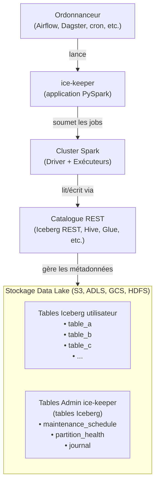
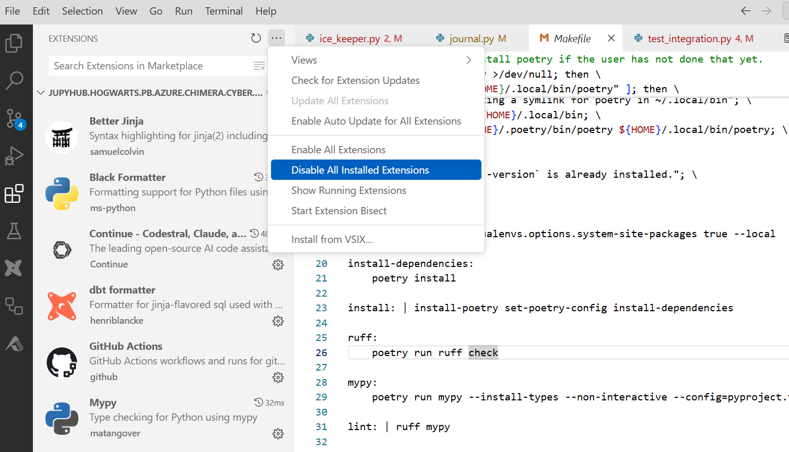
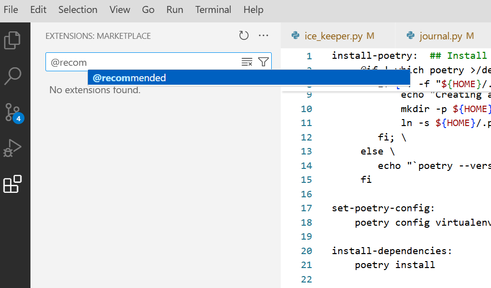
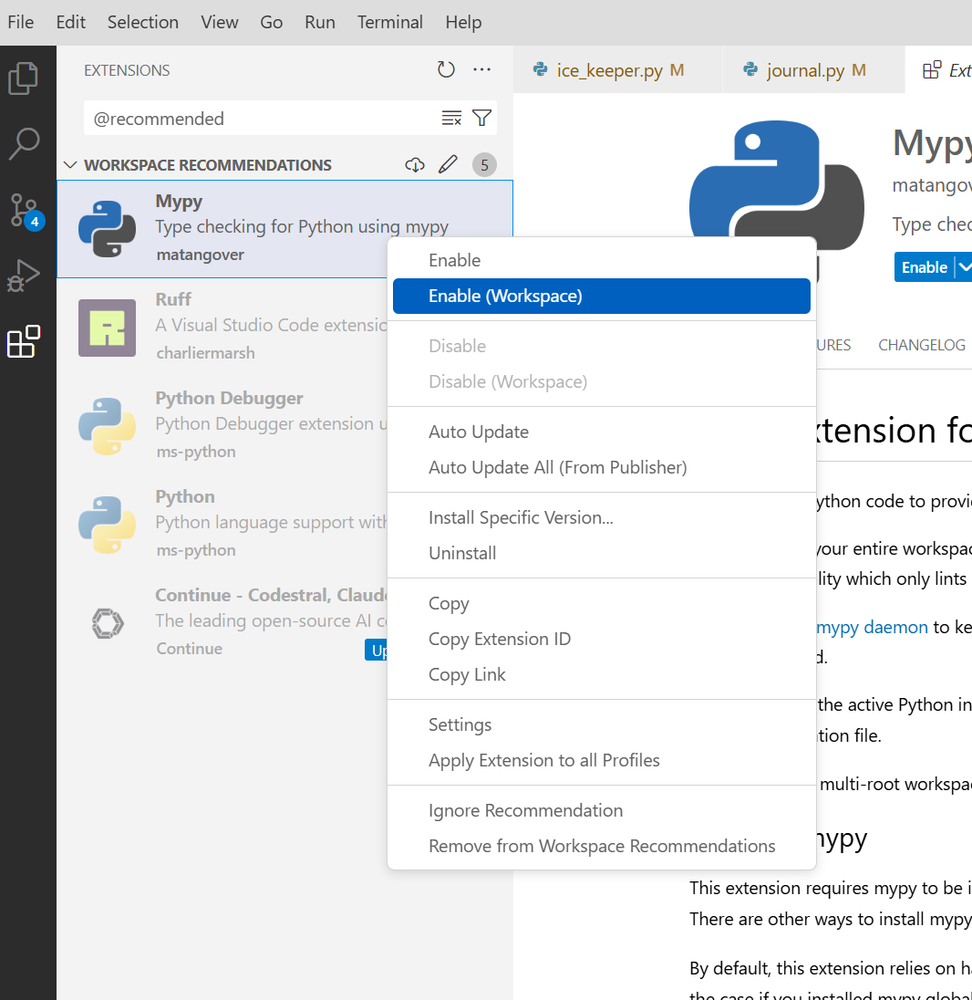

# ice-keeper

La bibliothèque Iceberg fournit des procédures stockées dans Spark pour la maintenance des tables. La plupart du temps, ces opérations relèvent de la responsabilité des administrateurs de la plateforme de données.

ice-keeper est un outil CLI pour automatiser la maintenance des tables Iceberg.

ice-keeper peut :

- découvrir de nouvelles tables à gérer
- expirer les anciens instantanés
- trouver et supprimer les fichiers orphelins (non suivis par Iceberg), en exploitant un rapport d'inventaire de stockage pour accélérer considérablement le processus
- supprimer les dossiers vides laissés après le nettoyage des fichiers orphelins
- exécuter une optimisation sur les partitions non saines pour améliorer les performances de recherche

ice-keeper est conçu pour effectuer la maintenance de centaines de tables simultanément et mieux utiliser les ressources Spark.

ice-keeper est généralement programmé pour s'exécuter chaque nuit dans Airflow, mais il peut être planifié dans votre ordonnanceur préféré (par exemple, Airflow, Dagster, cron ou tout autre outil d'orchestration).

ice-keeper s'inspire de cet article [Automated Table Maintenance for Apache Iceberg Tables](https://www.starburst.io/blog/automated-table-maintenance-for-apache-iceberg/) et du [script GitHub associé](https://github.com/mdesmet/trino-iceberg-maintenance/blob/main/trino_iceberg_maintenance/__main__.py).

## Architecture



**Points architecturaux clés :**

- **Aucun serveur externe requis.** ice-keeper est une application PySpark — si Spark peut accéder et optimiser une table, ice-keeper peut la gérer. La seule infrastructure nécessaire est une plateforme Spark avec un catalogue Iceberg.
- **Toute la configuration se fait via Spark.** ice-keeper se connecte au même catalogue et au même stockage que n'importe quel autre job Spark. Il n'y a pas de base de données ou de service séparé à déployer.
- **Les tables d'administration sont des tables Iceberg ordinaires.** Le calendrier de maintenance, les rapports de santé des partitions et le journal sont stockés sous forme de tables Iceberg dans le même catalogue, interrogeables par tout utilisateur Spark.
- **Architecture simple.** Cluster Spark + catalogue Iceberg + stockage data lake. C'est tout.

## Surveillance

Puisque les tables d'administration (calendrier de maintenance, santé des partitions et journal) sont des tables Iceberg ordinaires, vous pouvez facilement créer des tableaux de bord de surveillance par-dessus en utilisant votre couche de présentation préférée. Tout outil capable d'interroger des tables Iceberg — comme Superset/Trino, Grafana ou un notebook Spark — peut être utilisé pour visualiser l'activité de maintenance, suivre les échecs et surveiller la santé des partitions au fil du temps.

Par exemple :
- Interrogez la table **journal** pour suivre les taux de succès/échec, les temps d'exécution et le nombre de fichiers de données traités sur l'ensemble des tables gérées.
- Interrogez **partition_health** pour surveiller quelles partitions sont dégradées et comment elles s'améliorent après l'optimisation.
- Interrogez **maintenance_schedule** pour auditer la configuration actuelle de votre catalogue.

Aucune infrastructure supplémentaire n'est nécessaire — si vous pouvez interroger des tables Iceberg, vous pouvez surveiller ice-keeper.

## Démarrage

ice-keeper s'exécute depuis la ligne de commande et nécessite un argument d'action. La syntaxe est la suivante : `ice-keeper <action>`. Les actions disponibles incluent :

| Nom de l'action          | Description                                                                                                          |
| ------------------------ | -------------------------------------------------------------------------------------------------------------------- |
| **schedule**             | Afficher ou modifier le calendrier de maintenance.                                                                   |
| **discover**             | Identifier de nouvelles tables Apache Iceberg à gérer et mettre à jour les configurations des tables déjà suivies par ice-keeper. |
| **optimize**             | Améliorer les performances des tables à l'aide de stratégies binpack, sort ou zorder.                                |
| **expire**               | Supprimer les instantanés obsolètes pour préserver les performances et gérer le stockage.                            |
| **expire_fast**          | Supprimer rapidement les anciens instantanés via PyIceberg (métadonnées seulement, sans suppression de fichiers).   |
| **orphan**               | Nettoyer les fichiers de données ou de métadonnées orphelins qui ne sont plus référencés.                            |
| **rewrite_manifests**    | Réorganiser et optimiser les fichiers manifest pour une meilleure efficacité.                                        |
| **lifecycle**            | Supprimer les données des tables dépassant la période de rétention configurée.                                      |
| **diagnose**             | Diagnostiquer la santé d'une table en analysant ses partitions (sans exécuter l'optimisation).                       |
| **multi**                | Exécuter plusieurs commandes de maintenance sur plusieurs tables en une seule invocation.                             |
| **journal**              | Afficher les journaux des opérations telles que `optimize`, `expire`, `orphan` et `rewrite_manifests`.               |
| **reset**                | Supprimer et recréer les tables d'administration ice-keeper (schedule, journal, partition health).                   |
| **audit_config**         | Vérifier les propriétés des tables pour détecter les erreurs de frappe ou les clés de configuration ice-keeper invalides. |
| **notify**               | Envoyer des notifications par courriel pour les tables avec des tâches de maintenance en échec consécutif.            |

ice-keeper prend en charge une variété d'arguments optionnels, permettant de personnaliser les actions. L'utilisation est la suivante : `ice-keeper [options] <action>`

| Argument optionnel           | Description                                                                                                        |
| ---------------------------- | ------------------------------------------------------------------------------------------------------------------ |
| **--config_file**            | Chemin vers le fichier de configuration YAML. Lit également la variable d'environnement `ICEKEEPER_CONFIG`.         |
| **--catalog**                | Restreindre la portée de l'action au catalogue spécifié.                                                           |
| **--schema**                 | Restreindre la portée de l'action au schéma spécifié.                                                              |
| **--table_name**             | Restreindre la portée de l'action à la table spécifiée.                                                            |
| **--where**                  | Appliquer un filtre ad hoc pour déterminer la portée de l'action, par exemple `--where "full_name = 'dev_catalog.schema2.table4'"`. |
| **--set**                    | Utilisé exclusivement par l'action `schedule` pour spécifier les colonnes à modifier et leurs nouvelles valeurs.    |
| **--spark_master**           | L'URL du master Spark (par défaut : `local`).                                                                      |
| **--spark_executors**        | Définir le nombre d'exécuteurs Spark souhaités. Mettre cette valeur à zéro exécutera le processus uniquement avec un driver Spark. |
| **--spark_executor_cores**   | Spécifier le nombre de cœurs CPU alloués à chaque instance d'exécuteur.                                            |
| **--spark_executor_memory**  | Définir la taille de la RAM allouée à chaque exécuteur, par exemple `16g`.                                         |
| **--spark_driver_cores**     | Spécifier le nombre de cœurs CPU alloués au driver Spark.                                                          |
| **--spark_driver_memory**    | Définir la taille de la RAM allouée au driver Spark, par exemple `8g`.                                             |
| **--concurrency**            | Définir le nombre de tables à traiter en parallèle.                                                                |

## Action : discover

L'exécution du processus de découverte remplira la table `maintenance_schedule`.

```bash
./ice-keeper discover --catalog dev_catalog --schema jcc
```

Le processus de découverte demande à ice-keeper de scanner tous les catalogues et schémas. Pour chaque nouvelle table détectée, il crée une nouvelle entrée dans le calendrier de maintenance d'ice-keeper. Si l'entrée existe déjà, ice-keeper s'assure que toutes les modifications utilisateur sont prises en compte. Les modifications utilisateur sont des propriétés spécifiques à ice-keeper.

Inversement, pour toute table qui avait une entrée dans le calendrier de maintenance mais qui n'est plus présente dans le catalogue Iceberg, ice-keeper supprimera cette entrée de son calendrier de maintenance.

En résumé, l'action discover synchronise les informations trouvées dans le catalogue avec son calendrier de maintenance.

### Comment fonctionne l'action discover

Pour expliquer le processus de découverte, nous utiliserons une seule configuration, à savoir `should_expire_snapshots`. Cette configuration est définie sur true par défaut, sauf si l'utilisateur la remplace spécifiquement par une propriété `ice-keeper.should-expire-snapshots`.

| Configuration           | Propriété tblproperty              | Valeur par défaut |
| ----------------------- | ---------------------------------- | ----------------- |
| should_expire_snapshots | ice-keeper.should-expire-snapshots | true              |

Supposons qu'un utilisateur ait écrit une analyse et stocke les résultats dans une table Iceberg appelée `cyber_detections`. La table pourrait avoir été créée comme suit :

```sql
create or replace table dev_catalog.jcc.cyber_detections
(event_time timestamp, id long, col1 string)
using iceberg
partitioned by (days(event_time))
tblproperties(
   'write.format.default'='parquet'
)
```

L'exécution de cette commande `ice-keeper discover --catalog dev_catalog` lancera le processus de découverte. ice-keeper trouvera cette nouvelle table et l'inclura dans son calendrier de maintenance. Nous voyons que `should_expire_snapshots` est défini sur true car c'est la valeur par défaut pour cette configuration.

| full_name          | should_expire_snapshots | retention_days_snapshots | should_remove_orphan_files | retention_days_orphan_files |
| ------------------ | ----------------------- | ------------------------ | -------------------------- | --------------------------- |
| ..cyber_detections | true                    | 7                        | true                       | 5                           |

Chaque nuit, ice-keeper est lancé pour exécuter le processus d'expiration des instantanés en utilisant le calendrier de maintenance.

Si un utilisateur souhaite se désinscrire de ce comportement, il peut remplacer la configuration en créant sa table comme suit :

```sql
create or replace table dev_catalog.jcc.cyber_detections
(event_time timestamp, id long, col1 string)
using iceberg
partitioned by (days(event_time))
tblproperties(
   'write.format.default'='parquet',
   'ice-keeper.should-expire-snapshots'='false'
)
```

Ou, à tout moment, il peut modifier les propriétés de la table comme suit :

```sql
alter table dev_catalog.jcc.cyber_detections
set tblproperties ('ice-keeper.should-expire-snapshots'='false')
```

Il est facile de vérifier les propriétés tblproperties d'une table Iceberg :

```sql
show tblproperties dev_catalog.jcc.cyber_detections
```

Pour supprimer une propriété tblproperty :

```sql
alter table dev_catalog.jcc.cyber_detections
unset tblproperties ('ice-keeper.should-expire-snapshots')
```

## Affichage des modifications du calendrier de maintenance au fil du temps

Iceberg enregistre les modifications apportées aux tables via un historique des instantanés (commits). Nous pouvons exploiter cette fonctionnalité pour inspecter les modifications apportées au calendrier de maintenance. Ces modifications peuvent être effectuées via le processus de découverte ou manuellement par un administrateur. Dans tous les cas, une modification est apportée au calendrier de maintenance et peut donc être récupérée via la procédure Iceberg [create_changelog_view](https://iceberg.apache.org/docs/nightly/spark-procedures/#create_changelog_view).

Supposons que nous ayons exécuté cette commande pour mettre à jour le calendrier de maintenance :

```bash
./ice-keeper \
   --where " full_name = 'dev_catalog.admin.ice_keeper_maintenance_schedule' " \
   schedule \
   --set " retention_days_snapshots = 90 " \
```

Pour trouver les modifications effectuées dans la dernière heure, nous créons une vue des modifications en spécifiant un horodatage de début.

```sql
%%sparksql
CALL dev_catalog.system.create_changelog_view(
  table => 'admin.ice_keeper_maintenance_schedule',
  options => map('start-timestamp','1736881275000'),
  changelog_view => 'ice_keeper_maintenance_schedule_changes',
  identifier_columns => array('catalog', 'schema', 'table_name', 'full_name')
)
```

Nous pouvons ensuite afficher et interroger cette vue :

```sql
%%sparksql
select
  full_name,
  retention_days_snapshots,
  _change_type,
  _change_ordinal,
  _commit_snapshot_id
from
  ice_keeper_maintenance_schedule_changes
order by
  _change_ordinal asc,
  _change_type desc
```

Cela affichera les modifications apportées à la colonne `retention_days_snapshots` :

| last_updated_by                          | retention_days_snapshots | _change_type   | _change_ordinal | _commit_snapshot_id |
| --------------------------------------- | ------------------------ | -------------- | ---------------- | -------------------- |
| jupyhub/jcc    | 91                       | UPDATE_BEFORE  | 0                | 4563331490714018710  |
| jupyhub/jcc    | 90                       | UPDATE_AFTER   | 0                | 4563331490714018710  |

La procédure `create_changelog_view` ajoute 3 colonnes supplémentaires (`_change_type`, `_change_ordinal`, `_commit_snapshot_id`) qui sont expliquées en détail [ici](https://iceberg.apache.org/docs/nightly/spark-procedures/#create_changelog_view).

Si nous voulons voir l'heure de `committed_at` plutôt que l'ID de l'instantané, nous pouvons joindre la table de métadonnées `.snapshot`.

```sql
%%sparksql
select
  full_name,
  retention_days_snapshots,
  _change_type,
  _change_ordinal,
  s.committed_at
from
  ice_keeper_maintenance_schedule_changes as c
  left join dev_catalog.admin.ice_keeper_maintenance_schedule.snapshots as s
  on (c._commit_snapshot_id = s.snapshot_id)
order by
  _change_ordinal asc,
  _change_type desc
```

## L'Action Journal

En plus d'utiliser le mécanisme de journalisation Python, ice-keeper écrit également le résultat de chaque action individuelle effectuée sur les tables gérées. Toutes les actions sont enregistrées dans la table `journal`. Les actions utilisent un ensemble commun de colonnes, et certaines colonnes sont spécifiques à l'action.

| Nom de colonne                      | Description                                                                                                                |
| ----------------------------------- | -------------------------------------------------------------------------------------------------------------------------- |
| full_name                           | Nom complet de la table sur laquelle l'action a été effectuée.                                                             |
| catalog                             | Nom du catalogue.                                                                                                          |
| schema                              | Nom du schéma.                                                                                                             |
| table_name                          | Nom de la table.                                                                                                           |
| start_time                          | Heure de début de l'action.                                                                                                |
| end_time                            | Heure de fin de l'action.                                                                                                  |
| exec_time_seconds                   | Durée d'exécution en secondes.                                                                                             |
| sql_stm                             | **L'appel complet de la procédure SQL qui a été exécutée**, incluant tous les arguments.                                   |
| status                              | Statut de l'exécution : `SUCCESS`, `FAILED` ou `WARNING`.                                                                  |
| status_details                      | Détails supplémentaires tels que la trace de l'exception en cas d'échec.                                                   |
| executed_by                         | Identité ayant exécuté cette action.                                                                                       |
| action                              | Action effectuée : `rewrite_data_files`, `expire_snapshots`, `expire_fast_snapshots`, `rewrite_manifests`, `remove_orphan_files`, `lifecycle`.      |
| rewritten_data_files_count          | Nombre de fichiers de données réécrits. Utilisé par `rewrite_data_files`.                                                  |
| added_data_files_count              | Nombre de nouveaux fichiers de données créés. Utilisé par `rewrite_data_files`.                                            |
| rewritten_bytes_count               | Total d'octets réécrits. Utilisé par `rewrite_data_files`.                                                                 |
| failed_data_files_count             | Nombre de fichiers de données dont la réécriture a échoué. Utilisé par `rewrite_data_files`.                               |
| removed_delete_files_count          | Nombre de fichiers de suppression retirés lors de la compaction. Utilisé par `rewrite_data_files`.                         |
| deleted_data_files_count            | Nombre de fichiers de données supprimés. Utilisé par `expire_snapshots`.                                                   |
| deleted_position_delete_files_count | Nombre de fichiers de suppression positionnelle supprimés. Utilisé par `expire_snapshots`.                                 |
| deleted_equality_delete_files_count | Nombre de fichiers de suppression par égalité supprimés. Utilisé par `expire_snapshots`.                                   |
| deleted_manifest_files_count        | Nombre de fichiers manifest supprimés. Utilisé par `expire_snapshots`.                                                     |
| deleted_manifest_lists_count        | Nombre de listes de manifestes supprimées. Utilisé par `expire_snapshots`.                                                 |
| deleted_statistics_files_count      | Nombre de fichiers de statistiques supprimés. Utilisé par `expire_snapshots`.                                              |
| rewritten_manifests_count           | Nombre de manifestes réécrits. Utilisé par `rewrite_manifests`.                                                            |
| added_manifests_count               | Nombre de nouveaux manifestes créés. Utilisé par `rewrite_manifests`.                                                      |
| num_orphan_files_deleted            | Nombre de fichiers supprimés. Utilisé par `remove_orphan_files`.                                                           |
| lifecycle_deleted_data_files        | Nombre de fichiers de données supprimés par le cycle de vie. Utilisé par `lifecycle`.                                      |
| lifecycle_deleted_records           | Nombre d'enregistrements supprimés par le cycle de vie. Utilisé par `lifecycle`.                                           |
| lifecycle_changed_partition_count   | Nombre de partitions affectées par le cycle de vie. Utilisé par `lifecycle`.                                               |

_Tableau 2 : table journal_

> **Info :** La colonne `sql_stm` contient l'appel complet de la procédure avec tous les arguments, par exemple :
> ```sql
> CALL catalog.system.rewrite_data_files(
>   table => 'catalog.schema.my_table',
>   strategy => 'sort',
>   sort_order => 'id ASC',
>   where => 'event_time >= ...',
>   options => map('target-file-size-bytes', '536870912')
> )
> ```
> Cela vous permet de voir exactement ce qu'ice-keeper a exécuté et de copier-coller la commande pour la réexécuter manuellement si nécessaire.

Le journal peut être affiché à l'aide de l'action `journal`. Cette commande affichera les exécutions de expire_snapshots sur schema1.

```bash
./ice-keeper journal \
    --where " catalog = 'dev_catalog' and schema = 'schema1' and action = 'expire_snapshots' "
```

## L'Action Schedule

Le calendrier de maintenance peut être affiché à l'aide de l'action `schedule`. Cette commande affichera le calendrier de maintenance des tables dev_catalog.schema1.

```bash
./ice-keeper schedule \
    --where " catalog = 'dev_catalog' and schema = 'schema1' and table_name like 'telemetry%' "
```

## L'Action Expire

Dans Apache Iceberg, chaque modification des données d'une table crée une nouvelle version, appelée un instantané. Les métadonnées Iceberg suivent plusieurs instantanés en même temps pour permettre aux lecteurs utilisant d'anciens instantanés de terminer, pour permettre une consommation incrémentielle et pour les requêtes de voyage dans le temps.

Bien sûr, conserver toutes les données de table indéfiniment n'est pas pratique. Une partie de la maintenance de base des tables Iceberg consiste à expirer les anciens instantanés pour garder les métadonnées des tables petites et éviter les coûts de stockage élevés des fichiers de données inutiles. Les instantanés s'accumulent jusqu'à ce qu'ils soient expirés.

L'expiration est configurée avec deux paramètres :

- **Âge maximum des instantanés** (`ice-keeper.retention-days-snapshots`, par défaut : 7 jours) : une fenêtre temporelle au-delà de laquelle les instantanés sont supprimés.
- **Nombre minimum d'instantanés à conserver** (`ice-keeper.retention-num-snapshots`, par défaut : 1) : un nombre minimum d'instantanés à conserver dans l'historique. À mesure que de nouveaux instantanés sont ajoutés, les plus anciens sont supprimés.

ice-keeper n'exécute l'expiration que sur les tables où `should_expire_snapshots` est activé et où la table a été récemment modifiée (c'est-à-dire que de nouveaux instantanés existent).

En interne, ice-keeper appelle la procédure Iceberg `expire_snapshots` :

```sql
CALL catalog.system.expire_snapshots(
  table => 'schema.table_name',
  older_than => timestamp '2026-05-01 00:00:00',
  retain_last => 1,
  stream_results => true
)
```

Cette commande exécute l'action expire :

```bash
./ice-keeper expire --where " full_name = 'dev_catalog.schema1.telemetry_1' "
```

## L'Action Orphan

Le nettoyage des fichiers orphelins — fichiers de données qui ne sont pas référencés par les métadonnées de la table — est une partie importante de la maintenance des tables qui réduit les coûts de stockage.

### Que sont les fichiers orphelins et comment sont-ils créés ?

Les fichiers orphelins sont des fichiers dans le répertoire de données de la table qui ne font pas partie de l'état de la table. Comme leur nom l'indique, les fichiers orphelins ne sont pas suivis par Iceberg, ne sont référencés par aucun instantané dans le journal des instantanés d'une table et ne sont pas utilisés par les requêtes.

Les fichiers orphelins proviennent des échecs dans les systèmes distribués qui écrivent dans les tables Iceberg. Par exemple, si un driver Spark manque de mémoire et se bloque après que certaines tâches ont réussi à créer des fichiers de données, ces fichiers resteront dans le stockage, mais ne seront jamais validés dans la table.

#### Le défi des fichiers orphelins

Les fichiers orphelins s'accumulent avec le temps ; s'ils ne sont pas référencés dans les métadonnées de la table, ils ne peuvent pas être supprimés par l'expiration normale des instantanés. À mesure qu'ils s'accumulent, les coûts de stockage continuent d'augmenter, il est donc conseillé de les trouver et de les supprimer régulièrement. La meilleure pratique recommandée est d'exécuter un nettoyage des fichiers orphelins chaque semaine ou chaque mois.

Supprimer les fichiers orphelins peut être délicat. Cela nécessite de comparer l'ensemble complet des fichiers référencés dans une table à l'ensemble actuel des fichiers dans le magasin d'objets sous-jacent. Cela en fait également une opération gourmande en ressources, en particulier si vous avez un grand volume de fichiers dans les répertoires de données et de métadonnées.

De plus, les fichiers peuvent sembler orphelins lorsqu'ils font partie d'une opération de validation en cours. Iceberg utilise une concurrence optimiste, donc les écrivains créeront tous les fichiers qui font partie d'une opération avant la validation. Jusqu'à ce que la validation réussisse, les fichiers ne sont pas référencés. Pour éviter de supprimer des fichiers qui font partie d'une validation en cours, les procédures de maintenance utilisent un argument `olderThan`. La rétention est contrôlée par `ice-keeper.retention-days-orphan-files` (par défaut : 5 jours).

#### Exploitation d'un rapport d'inventaire de stockage

Par défaut, la procédure Iceberg `remove_orphan_files` liste tous les fichiers dans le répertoire de stockage de la table pour trouver les orphelins. Cela peut être très lent et coûteux pour les grandes tables.

Lorsqu'un rapport d'inventaire de stockage est configuré, ice-keeper l'utilise pour accélérer considérablement la détection des fichiers orphelins. Au lieu de lister le magasin d'objets en temps réel, ice-keeper interroge l'inventaire préconstruit pour obtenir la liste des fichiers existants et la transmet à la procédure via le paramètre `file_list_view`.

L'inventaire est également utilisé pour **détecter et supprimer les dossiers vides** laissés après la suppression de fichiers. ice-keeper identifie les dossiers feuilles (dossiers qui ne sont parents d'aucune autre entrée) avec une taille de zéro octet et les inclut dans la liste de fichiers afin qu'ils soient nettoyés en même temps que les fichiers de données orphelins.

#### Débogage avec le SQL journalisé

ice-keeper journalise les instructions SQL qu'il utilise pour construire la liste de fichiers à partir de l'inventaire. Celles-ci incluent :
- La requête pour trouver les fichiers de données (`.parquet`, `.avro`, `.json`) sous les répertoires `data/` et `metadata/` de la table
- La requête pour trouver les dossiers feuilles vides

Vous pouvez copier-coller ces instructions SQL depuis les journaux pour examiner exactement comment ice-keeper détermine quels fichiers transmettre à la procédure `remove_orphan_files`.

En interne, ice-keeper appelle la procédure Iceberg `remove_orphan_files` :

```sql
CALL catalog.system.remove_orphan_files(
  table => 'schema.table_name',
  older_than => timestamp '2026-05-01 00:00:00',
  file_list_view => 'file_list_view',
  dry_run => false
)
```

Cette commande exécute l'action orphan :

```bash
./ice-keeper orphan --where " full_name = 'dev_catalog.schema1.telemetry_1' "
```

## L'Action Rewrite Manifest

Cette commande exécute l'action rewrite_manifests, qui exécute la procédure Iceberg `rewrite_manifests`.

```bash
./ice-keeper rewrite_manifests --where " full_name = 'dev_catalog.schema1.telemetry_1' "
```

## L'Action Optimize

La motivation principale pour créer Apache Iceberg était de rendre les transactions sûres et fiables. Sans écritures concurrentes sûres, les pipelines n'ont qu'une seule opportunité d'écrire des données dans une table. Les changements inutiles sont risqués : les requêtes pourraient produire des résultats à partir de mauvaises données et les écrivains pourraient corrompre définitivement une table. En bref, les tâches d'écriture sont responsables de trop de choses et doivent faire des compromis, conduisant souvent à des problèmes de performance persistants comme le problème des « petits fichiers ».

Avec les mises à jour fiables qu'offre Iceberg, vous pouvez décomposer la préparation des données en tâches distinctes. Les écrivains sont responsables de la transformation et de la mise à disposition rapide des données. Les optimisations de performance comme la compaction sont appliquées plus tard en tant que tâches en arrière-plan.

La compaction des fichiers n'est pas seulement une solution au problème des petits fichiers. La compaction réécrit les fichiers de données, ce qui est une opportunité pour également reclasser, repartitionner et supprimer les lignes supprimées.

### Stratégies d'optimisation

ice-keeper prend en charge trois stratégies d'optimisation, contrôlées par la propriété de table `ice-keeper.optimization-strategy` :

- **`binpack`** — Compacte les petits fichiers sans réordonnancement. Ne réécrit que les fichiers en dehors de la plage 0.5x–2.0x de la taille cible. Les fichiers déjà à la bonne taille ne sont pas touchés (`rewrite-all: false`).
- **Sort** (ex. `id ASC, ts DESC`) — Réécrit tous les fichiers de données triés selon les colonnes spécifiées (`rewrite-all: true`). Améliore les performances des requêtes pour les filtres sur les colonnes de tri.
- **Z-order** (ex. `zorder(src_ip, dst_ip)`) — Réécrit tous les fichiers de données avec un entrelacement Z-order sur les colonnes spécifiées (`rewrite-all: true`). Améliore les performances des requêtes lorsque les filtres peuvent porter sur n'importe quelle combinaison des colonnes Z-ordonnées.

### Taille cible des fichiers

La taille cible des fichiers est contrôlée par `ice-keeper.optimization-target-file-size-bytes` (défaut : `-1`, ce qui signifie **automatique**).

Lorsque la valeur est `-1`, ice-keeper sélectionne automatiquement une taille cible par partition en fonction de la taille totale des données de cette partition. C'est le réglage recommandé. Voir la documentation utilisateur pour le tableau complet des tailles.

Lorsqu'une valeur spécifique en octets est définie (ex. `536870912` pour 512 Mo), cette taille fixe est utilisée pour toutes les partitions.

> **Note :** La propriété native Iceberg `write.target-file-size-bytes` n'est **pas** utilisée par ice-keeper. Si vous souhaitez que ice-keeper optimise avec la même taille cible que votre configuration d'écriture, vous devez explicitement définir `ice-keeper.optimization-target-file-size-bytes`.

### Fenêtre de diagnostic

L'action optimize exécute d'abord un diagnostic sur chaque partition dans la fenêtre configurée (`ice-keeper.min-partition-to-optimize` à `ice-keeper.max-partition-to-optimize`) pour évaluer la santé des partitions. Seules les partitions nécessitant réellement une optimisation sont réécrites.

L'évaluation de la santé dépend de la stratégie :
- **Binpack** : une partition nécessite une optimisation lorsque plus de 10 % de ses fichiers sont en dehors de la plage de taille cible et que le nombre dépasse `ice-keeper.binpack-min-input-files` (défaut : 5), ou lorsque des fichiers de suppression sont présents.
- **Sort** : une partition nécessite une optimisation lorsque la corrélation (`corr`) entre l'ordre des fichiers et l'ordre de tri descend en dessous du seuil (défaut : 0.97), ou lorsque des fichiers de suppression sont présents.
- **Z-order** : identique à sort, mais utilise un seuil de corrélation dynamique basé sur le nombre de fichiers dans la partition.

### Regroupement des partitions

La propriété `ice-keeper.optimize-partition-depth` (défaut : `-1`, regroupement dynamique) contrôle comment les partitions sont regroupées pour les appels d'optimisation :
- **Regroupement dynamique** (`-1`) : regroupe automatiquement les sous-partitions en groupes allant jusqu'à `ice-keeper.optimization-grouping-size-bytes` (défaut : 16 Go) par appel `rewrite_data_files`.
- **Profondeur fixe** (ex. `1`, `2`) : regroupe les partitions par les N premiers niveaux de partition.

### Budget de temps

La propriété `ice-keeper.optimization-quota-hours` (défaut : 6) définit un budget de temps par table. Si l'optimisation dépasse cette durée, ice-keeper s'arrête et continue avec la table suivante.

### Ignorer les partitions déjà optimisées

ice-keeper suit la santé des partitions dans la table `partition_health`. Si le `max_file_sequence_number` d'une partition n'a pas changé depuis la dernière optimisation réussie (dans les 30 derniers jours), elle est ignorée pour éviter un travail redondant.

### Invocation de l'action optimize

```bash
./ice-keeper optimize --where " full_name = 'dev_catalog.schema1.telemetry_1' "
```

En interne, ice-keeper appelle la procédure Iceberg `rewrite_data_files` :

```sql
CALL catalog.system.rewrite_data_files(
  table => 'schema.table_name',
  strategy => 'sort',
  sort_order => 'id ASC, ts DESC',
  where => 'event_time >= ...',
  options => map(
    'target-file-size-bytes', '536870912',
    'rewrite-all', 'true'
  )
)
```

### Table partition_health

Après les optimisations, ice-keeper stocke un rapport avant/après de la santé des partitions dans la table `partition_health`. Cette table utilise un format struct imbriqué avec des colonnes `before` et `after` :

| Nom de colonne | Description                                                                    |
| -------------- | ------------------------------------------------------------------------------ |
| start_time     | Horodatage de l'exécution de l'optimisation.                                   |
| full_name      | Nom complet de la table.                                                       |
| catalog        | Nom du catalogue.                                                              |
| schema         | Nom du schéma.                                                                 |
| table_name     | Nom de la table.                                                               |
| partition_desc | Description de la partition (ex. `event_time_day=2026-01-15`).                 |
| partition_age  | Rang d'âge de la partition par rapport à la plus récente.                       |
| optimized      | Si la partition a été réellement optimisée (numéro de séquence modifié).        |
| before / after | Structs contenant : `n_files`, `num_files_targetted_for_rewrite`, `n_records`, `avg_file_size`, `min_file_size`, `max_file_size`, `sum_file_size`, `corr`, `max_file_sequence_number`. |

_Tableau 3 : table partition_health_

## L'Action Diagnosis

Dans le cadre du processus d'optimisation, ice-keeper exécute d'abord un diagnostic sur la table pour identifier les partitions nécessitant une optimisation. Vous pouvez également invoquer manuellement l'action diagnosis sur n'importe quelle table, même si elle n'est pas encore configurée pour être optimisée. Cela est utile pour vérifier si une table bénéficierait d'une maintenance par ice-keeper.

### Ce que fait le diagnostic

Le diagnostic évalue la santé des partitions en exécutant une requête SQL complexe sur les métadonnées `data_files` de la table. Pour chaque partition (dans la fenêtre configurée), il calcule :

- **Nombre et tailles des fichiers** — nombre de fichiers, taille moyenne/min/max/somme
- **Fichiers ciblés pour réécriture** — fichiers en dehors de la plage 0.5x–2.0x de la taille cible
- **Corrélation (`corr`)** — qualité du tri des fichiers de données (1.0 = parfaitement trié)
- **Fichiers de suppression** — nombre de fichiers de suppression et d'enregistrements supprimés
- **Numéro de séquence** — `max_file_sequence_number` pour le suivi des partitions déjà optimisées
- **`should_optimize`** — un indicateur booléen indiquant si la partition nécessite une optimisation

L'indicateur `should_optimize` dépend de la stratégie :
- **Binpack** : vrai lorsque plus de 10 % des fichiers sont en dehors de la plage de taille cible et que le nombre dépasse `binpack_min_input_files` (défaut : 5), ou lorsque des fichiers de suppression sont présents.
- **Sort** : vrai lorsque `corr < corr_threshold` (défaut : 0.97), ou lorsque des fichiers de suppression sont présents.
- **Z-order** : vrai lorsque `corr < seuil_dynamique` (le seuil varie en fonction du nombre de fichiers dans la partition).

### Journalisation du diagnostic

ice-keeper journalise toutes les instructions SQL du diagnostic et leurs résultats au niveau de log DEBUG. Cela permet de copier/coller la sortie du diagnostic et d'investiguer en détail le comportement de l'évaluation de santé. Concrètement, les logs incluent :

1. **Le SQL complet du diagnostic** — formaté via `sqlparse`, montrant la chaîne CTE complète qui calcule les métriques de santé des partitions
2. **Le tableau résumé des partitions** — un tableau formaté montrant chaque partition avec ses `n_files`, `num_files_targetted_for_rewrite`, `target_file_size`, `avg_file_size`, `corr`, `corr_threshold`, `n_delete_files`, `should_optimize`, et les tailles en format lisible
3. **Les partitions sélectionnées pour l'optimisation** — quelles partitions ont dépassé le seuil et seront optimisées, regroupées selon la profondeur de partition configurée ou le regroupement dynamique

En lisant la sortie du diagnostic, vous pouvez clairement voir le processus de décision suivi par ice-keeper : quel SQL a été exécuté, quels seuils ont été appliqués, quel est le facteur de corrélation pour chaque partition, combien de fichiers sont à la taille cible, et pourquoi chaque partition a été ou non sélectionnée pour l'optimisation.

> **Astuce :** Réglez le niveau de journalisation à `DEBUG` dans votre `logging_config.yaml` pour voir la sortie complète du diagnostic. Vous pouvez ensuite rediriger la sortie vers un fichier pour analyse.

### Exécution manuelle du diagnostic

```bash
ICEKEEPER_CONFIG=./config/ice-keeper.yaml \
  ./ice-keeper diagnose \
  --full_name dev_catalog.schema1.table1 \
  --max_partition_to_diagnose 30d \
  --optimization_strategy 'address ASC NULLS FIRST, id DESC'
```

Options disponibles :

| Option | Description |
| --- | --- |
| `--full_name` | Nom complet de la table (requis). |
| `--min_partition_to_diagnose` / `--max_partition_to_diagnose` | Plage de partitions basée sur le temps (ex. `1d`, `7d`, `1M`). |
| `--min_age_to_diagnose` / `--max_age_to_diagnose` | Plage de partitions basée sur l'âge (rang entier). Mutuellement exclusif avec la plage basée sur le temps. |
| `--optimization_strategy` | Remplacer la stratégie (ex. `binpack`, `id ASC`, `zorder(col1, col2)`). |
| `--target_file_size_bytes` | Remplacer la taille cible des fichiers. |
| `--sort_corr_threshold` | Remplacer le seuil de corrélation. |
| `--binpack_min_input_files` | Remplacer le nombre minimum de fichiers pour binpack. |
| `--optimize_partition_depth` | Remplacer la profondeur de regroupement des partitions. |
| `--optimization_grouping_size_bytes` | Remplacer la taille du regroupement dynamique. |

L'option `--optimization_strategy` accepte les mêmes valeurs que la propriété de table `ice-keeper.optimization-strategy`.

## Allocation des Ressources Spark

L'action expire exécute les procédures `expire_snapshots` et `rewrite_manifests`. Ces procédures n'utilisent pas les workers Spark. Ainsi, nous configurons ice-keeper avec `--spark_executors 0`. Cependant, `rewrite_manifests` peut nécessiter beaucoup de mémoire sur certaines tables, nous l'exécutons donc avec une grande quantité de RAM (`--spark_driver_memory 32g`).

```bash
./ice-keeper expire \
    --concurrency 32 \
    --spark_driver_cores 16 \
    --spark_driver_memory 16g \
    --spark_executors 10 \
    --spark_executor_cores 10 \
    --spark_executor_memory 10g \
    --where "$where"
```

L'action orphan exécute une procédure `remove_orphan_files` qui s'exécute sur les workers Spark. Cette procédure construit une liste de fichiers existants (côté droit) et une liste de fichiers suivis (côté gauche). Elle joint ensuite ces deux tables pour trouver les fichiers non suivis et les supprime. Comme tout ce travail est effectué sur les workers Spark, nous pouvons exécuter cette procédure sur des centaines de tables simultanément.

```bash
./ice-keeper orphan \
    --concurrency 8 \
    --spark_driver_cores 16 \
    --spark_driver_memory 32g \
    --spark_executors 10 \
    --spark_executor_cores 10 \
    --spark_executor_memory 10g \
    --where "$where"
```

## Configuration de l'Environnement de Développement

### Prérequis

- Python 3.10+
- [uv](https://docs.astral.sh/uv/) (installé automatiquement par `make install`)
- Java 11+ (requis par Spark)

### Installation

Cela installera `uv` dans un environnement virtuel privé situé dans `~/.local`, synchronisera les dépendances du projet et téléchargera le JAR Iceberg Spark runtime :

```bash
make install
```

### Configuration de l'IDE (code-server / VS Code)

1. Désactivez toutes les extensions :


2. Recherchez les extensions recommandées pour le projet :


Vous devrez peut-être exécuter la recherche plusieurs fois avant que code-server ne trouve les extensions recommandées.

3. Activez les extensions recommandées pour votre espace de travail :


### Structure du projet

```
ice_keeper/              # Package principal
  ice_keeper.py          # Point d'entrée CLI (commandes Click)
  config.py              # Chargement de la configuration
  catalog.py             # Gestion des catalogues
  task/                  # Framework de tâches
    action/              # Actions de maintenance (optimize, expire, orphan, ...)
      optimization/      # Logique d'optimisation (diagnostic, regroupement, ...)
  spec/                  # Spécifications (optimisation, partition, transformation, ...)
  table/                 # Tables d'administration (journal, schedule, partition_health)
  templates/             # Templates SQL/Jinja2
tests/
  unit/                  # Tests unitaires (sans Spark)
  integration/           # Tests d'intégration (Spark local + Iceberg)
  config/                # Fichiers de configuration des tests
```

### Exécution des tests

Les tests sont gérés avec `pytest` et divisés en deux catégories :

**Les tests unitaires** s'exécutent sans Spark et testent la logique Python pure (parsing de configuration, découverte, courriel, calculs z-order, etc.) :

```bash
make unit-test
```

**Les tests d'intégration** s'exécutent avec une session Spark locale et un catalogue Hadoop local sur le système de fichiers local. Ils créent de véritables tables Iceberg avec des propriétés, insèrent des données et exécutent des actions de maintenance (optimize, expire, orphan, rewrite, discovery, widening, etc.) :

```bash
make integration-test
```

Tous les tests fonctionnent entièrement hors ligne — aucune infrastructure cloud ni catalogue distant n'est nécessaire. Les fixtures de test configurent automatiquement une session Spark locale avec les extensions Iceberg et un répertoire d'entrepôt temporaire sur le disque local.

Pour exécuter tous les tests :

```bash
make all-test
```

### Linting et formatage

```bash
make lint          # Exécuter ruff check + mypy
make format        # Auto-formater avec ruff
make format-check  # Vérifier le formatage sans modifier
```

### Vérification pré-commit

Exécuter toutes les vérifications (formatage, linting, tests) avant de commiter :

```bash
make precommit
```

## Plans d'Exécution et Allocations de Ressources

### Expire

La procédure expire_snapshots lit les métadonnées via all_manifests (voir BatchScan(5 et 17)). Elle agrège ensuite et fusionne ces listes.

Une fois cela fait, le driver utilise un `toLocalIterator` et semble supprimer les instantanés en fonction de cet itérateur. Lorsque le driver appelle `toLocalIterator`, les workers utilisent tous leurs CPU pour exécuter ce plan (50 CPU sont utilisés). Du côté du driver, les suppressions sont effectuées à l'aide de threads et peuvent utiliser jusqu'à 30 CPU.

Il utilise un `broadcast hash join`, mais j'ai rencontré cette erreur :

```
Job aborted due to stage failure: Total size of serialized results of 468 tasks (4.0 GiB) is bigger than spark.driver.maxResultSize (4.0 GiB)
```

Pour résoudre ce problème, j'ai configuré le driver pour autoriser des résultats jusqu'à 4 Go. J'ai également augmenté les partitions de shuffle de 200 à 800. Cela crée des tâches plus petites, car les ensembles de données sont divisés en 800 tâches au lieu de 200.

```bash
.config("spark.sql.shuffle.partitions", "800")
.config("spark.driver.maxResultSize", "4g")
```

Voici le plan d'exécution de la procédure expire_snapshots :

```
+- == Current Plan ==
   HashAggregate (25)
   +- Exchange (24)
      +- HashAggregate (23)
         +- BroadcastHashJoin LeftAnti BuildRight (22)
            :- SerializeFromObject (4)
            :  +- MapPartitions (3)
            :     +- DeserializeToObject (2)
            :        +- LocalTableScan (1)
            +- BroadcastExchange (21)
               +- Union (20)
                  :- SerializeFromObject (16)
                  :  +- MapPartitions (15)
                  :     +- DeserializeToObject (14)
                  :        +- ShuffleQueryStage (13)
                  :           +- Exchange (12)
                  :              +- * HashAggregate (11)
                  :                 +- AQEShuffleRead (10)
                  :                    +- ShuffleQueryStage (9), Statistics(sizeInBytes=177.3 MiB, rowCount=7.49E+5)
                  :                       +- Exchange (8)
                  :                          +- * HashAggregate (7)
                  :                             +- * Project (6)
                  :                                +- BatchScan abfss://warehouse@mydatalake.dfs.core.windows.net/iceberg/schema1/telemetry/metadata/320826-59c74ee4-e849-4067-9b91-6fbe5f249b32.metadata.json#all_manifests (5)
                  :- Project (18)
                  :  +- BatchScan abfss://warehouse@mydatalake.dfs.core.windows.net/iceberg/schema1/telemetry/metadata/320826-59c74ee4-e849-4067-9b91-6fbe5f249b32.metadata.json#all_manifests (17)
                  +- LocalTableScan (19)
```

### rewrite_manifest

`LocalTableScan` (voir 4 ci-dessous) semble être la liste des fichiers manifest dans une table de streaming (7 jours d'instantanés), qui peut contenir des milliers de fichiers d'une taille de 10 Mo. `BatchScan` (voir 1 ci-dessous) lit `dev_catalog.schema1.table1.entries` (entrées actuelles, pas sur all_entries). Le nombre d'entrées dans une table peut devenir très élevé, en particulier lorsque la table est écrite à l'aide d'un job Spark streaming. Cela peut atteindre des centaines de milliers (pour une table avec 6 mois de rétention).

En général, ce n'est pas un gros job Spark, mais il peut tout de même bénéficier d'une exécution sur le cluster Spark.

Le plan d'exécution d'une procédure rewrite_manifest :

```
AdaptiveSparkPlan (24)
+- == Final Plan ==
   * SerializeFromObject (14)
   +- MapPartitions (13)
      +- DeserializeToObject (12)
         +- * Sort (11)
            +- ShuffleQueryStage (10), Statistics(sizeInBytes=19.7 MiB, rowCount=5.70E+3)
               +- Exchange (9)
                  +- * Project (8)
                     +- * BroadcastHashJoin LeftSemi BuildRight (7)
                        :- * Project (3)
                        :  +- * Filter (2)
                        :     +- BatchScan dev_catalog.schema1.sa_beacon.entries (1)
                        +- BroadcastQueryStage (6), Statistics(sizeInBytes=8.0 MiB, rowCount=373)
                           +- BroadcastExchange (5)
                              +- LocalTableScan (4)
```

### Orphans

La procédure remove_orphan_files construit une liste de fichiers existants (côté droit). Elle construit également une liste de fichiers suivis (côté gauche). Ces tables sont ensuite jointes pour trouver les fichiers non suivis.

Ce job peut échouer en raison d'une jointure broadcast trop grande. J'ai modifié la configuration Spark pour désactiver la jointure broadcast et privilégier la jointure sort merge, qui ne peut jamais échouer. Il y a probablement un très faible coût à utiliser une jointure sort merge pour les petites tables, mais c'est un petit prix à payer pour la stabilité sur toutes les tables. La tâche ExpireSnapshotTask configure cela avec :

```python
self.spark.conf.set("spark.sql.autoBroadcastJoinThreshold", "-1")
```

Une fois la liste des fichiers non suivis déterminée, ils sont supprimés, probablement par les workers (à confirmer). Comme tout ce travail est effectué par les workers, nous pouvons exécuter cette procédure sur des centaines de tables simultanément.

Il semble y avoir une première phase où la procédure lit les fichiers de métadonnées, mais sans utiliser une tâche Spark. Cela signifie que je la vois s'exécuter dans l'interface utilisateur Spark, mais je ne vois pas de tâches associées, ce qui rend difficile l'évaluation de l'utilisation des CPU.

Plan d'exécution d'une procédure remove_orphan_files :

```
AdaptiveSparkPlan (86)
+- == Final Plan ==
   * SerializeFromObject (51)
   +- MapPartitions (50)
      +- DeserializeToObject (49)
         +- * SortMergeJoin LeftOuter (48)
            :- * Sort (8)
            :  +- AQEShuffleRead (7)
            :     +- ShuffleQueryStage (6), Statistics(sizeInBytes=223.8 KiB, rowCount=578)
            :        +- Exchange (5)
            :           +- * Project (4)
            :              +- * SerializeFromObject (3)
            :                 +- MapPartitions (2)
            :                    +- Scan (1)
            +- * Sort (47)
               +- AQEShuffleRead (46)
                  +- ShuffleQueryStage (45), Statistics(sizeInBytes=583.9 KiB, rowCount=1.56E+3)
                     +- Exchange (44)
                        +- Union (43)
                           :- * Project (23)
                           :  +- * Filter (22)
                           :     +- * SerializeFromObject (21)
                           :        +- MapPartitions (20)
                           :           +- MapPartitions (19)
                           :              +- DeserializeToObject (18)
                           :                 +- ShuffleQueryStage (17), Statistics(sizeInBytes=44.3 KiB, rowCount=227)
                           :                    +- Exchange (16)
                           :                       +- * HashAggregate (15)
                           :                          +- AQEShuffleRead (14)
                           :                             +- ShuffleQueryStage (13), Statistics(sizeInBytes=53.2 KiB, rowCount=227)
                           :                                +- Exchange (12)
                           :                                   +- * HashAggregate (11)
                           :                                      +- * Project (10)
                           :                                         +- BatchScan dev_catalog.schema1.telemetry1.all_manifests (9)
                           :- * Project (30)
                           :  +- * Filter (29)
                           :     +- * SerializeFromObject (28)
                           :        +- MapPartitions (27)
                           :           +- DeserializeToObject (26)
                           :              +- * Project (25)
                           :                 +- BatchScan dev_catalog.schema1.telemetry1.all_manifests (24)
                           :- * Project (36)
                           :  +- * Filter (35)
                           :     +- * SerializeFromObject (34)
                           :        +- MapPartitions (33)
                           :           +- DeserializeToObject (32)
                           :              +- LocalTableScan (31)
                           +- * Project (42)
                              +- * Filter (41)
                                 +- * SerializeFromObject (40)
                                    +- MapPartitions (39)
                                       +- DeserializeToObject (38)
                                          +- LocalTableScan (37)
```
