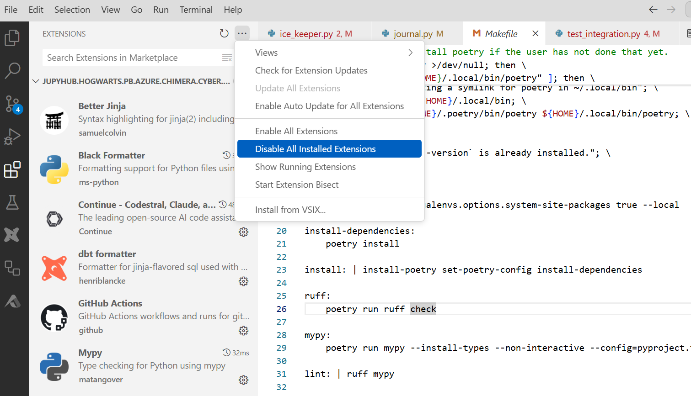
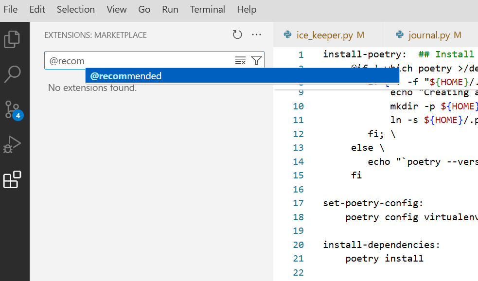
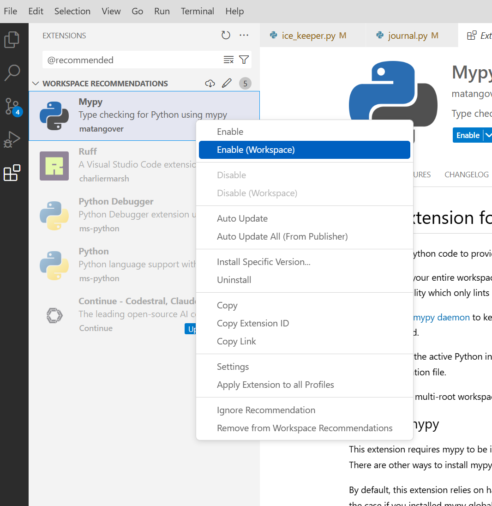

# ice-keeper

The Iceberg library provides stored procedures in Spark for table maintenance. Most of the time, these operations are the responsibility of data platform administrators.

ice-keeper is a CLI tool to automate Iceberg table maintenance of Iceberg tables.

ice-keeper can:

- discover new tables to manage
- expire old snapshots
- find and remove orphan files (not tracked by Iceberg)
- run an optimization on unhealthy partitions to improve search performance.

ice-keeper is designed to run maintenance on hundreds of tables concurrently and make better use of our spark resources.

ice-keeper is scheduled to run every night in Airflow.

ice-keeper was inspired by this article [Automated Table Maintenance for Apache Iceberg Tables](https://www.starburst.io/blog/automated-table-maintenance-for-apache-iceberg/) and the associated [GitHub script](https://github.com/mdesmet/trino-iceberg-maintenance/blob/main/trino_iceberg_maintenance/__main__.py).

## Getting started

ice-keeper is executed from the command line and requires an action argument. The syntax is as follows: `ice-keeper <action>`. The available actions include:

| Action Name          | Description                                                                                                          |
| -------------------- | -------------------------------------------------------------------------------------------------------------------- |
| **schedule**         | View or modify the maintenance schedule.                                                                             |
| **discover**         | Identify new Apache Iceberg tables for management and update configurations of tables already tracked by ice-keeper. |
| **optimize**         | Enhance table performance using binpack or sort strategies.                                                          |
| **expire**           | Remove outdated snapshots to preserve performance and manage storage.                                                |
| **orphans**          | Clean up orphaned data or metadata files that are no longer referenced.                                              |
| **rewrite_manifest** | Reorganize and streamline manifest files for better efficiency.                                                      |
| **journal**          | Display logs of operations such as `optimize`, `expire`, `orphans`, and `rewrite_manifest`.                          |

ice-keeper supports a variety of optional arguments, allowing customization of the actions. Usage is as follows: `ice-keeper <action> [options]`

| Optional Argument           | Description                                                                                                        |
| --------------------------- | ------------------------------------------------------------------------------------------------------------------ |
| **--catalog**               | Restrict the scope of the action to the specified catalog.                                                         |
| **--schema**                | Restrict the scope of the action to the specified schema.                                                          |
| **--table_name**            | Restrict the scope of the action to the specified table.                                                           |
| **--where**                 | Apply an ad-hoc filter to determine the scope of the action, e.g., `--where "full_name = 'dev_catalog.schema2.table4'"`. |
| **--set**                   | Used exclusively by the `schedule` action to specify which columns to modify and their new values.                 |
| **--spark_executors**       | Define the number of Spark executors desired. Setting this to zero will run the process using only a Spark driver. |
| **--spark_executor_cores**  | Specify the number of CPU cores allocated to each executor instance.                                               |
| **--spark_executor_memory** | Define the RAM size allocated to each executor, e.g., `16g`.                                                       |
| **--spark_driver_cores**    | Specify the number of CPU cores allocated to the Spark driver.                                                     |
| **--spark_driver_memory**   | Define the RAM size allocated to the Spark driver, e.g., `8g`.                                                     |
| **--concurrency**           | Set the number of tables to be processed in parallel.                                                              |
|                             |

## Action: discover

Running the discovery process will populate the `maintenance_schedule` table.

```bash
./ice-keeper discover  --catalog dev_catalog --schema jcc
```

The discovery process instructs ice-keeper to scans all catalogs and schemas. For each new table detected, it creates a new entry in ice-keeper's maintenance schedule. If the entry already exists, ice-keeper makes sure that any user overrides are taken into consideration. User overrides are special tblproperties specific to ice-keeper.

Conversely, for any table that had an entry in the maintenance schedule but is no longer is present in the Iceberg catalog ice-keeper will remove that entry from its maintenance schedule.

In a nutshell the discover action syncs the information found in the catalog with it's maintenance schedule.


Internally ice-keeper uses a table called `maintenance_schedule` and is initially empty. This table holds the following configuration columns. We have broken it into 3 parts in order to fit in on this page:

| column name                 | description                                                                          |
| --------------------------- | ------------------------------------------------------------------------------------ |
| full_name                   |
| catalog                     |
| schema                      |
| table_name                  |
| partition_by                |
| should_expire_snapshots     | These columns dictate if ice-keeper should remove old snapshots and old orphan files |
| retention_days_snapshots    |
| retention_num_snapshots     |
| should_remove_orphan_files  |
| retention_days_orphan_files |
| should_optimize             |
| optimization_strategy       |
| days_to_optimize            |
| target_file_size_bytes      |

_Table 1: maintenance_schedule table_

### How the discovery action works

To explain the discovery process we will use a single configuration namely `should_expire_snapshots`. This configuration defaults to true, unless the user specifically overrides it with a tblproperty `ice-keeper.should-expire-snapshots`.

| configuration           | tblproperty                        | default |
| ----------------------- | ---------------------------------- | ------- |
| should_expire_snapshots | ice-keeper.should-expire-snapshots | true    |

Let's suppose a user wrote an anlytic and stores the results into an Iceberg table called `cyber_detections`. The table might have been created as follows:

```sql
   create or replace table dev_catalog.jcc.cyber_detections
   (event_time timestamp, id long, col1 string)
   using iceberg
   partitioned by (days(event_time))
   tblproperties(
      'write.format.default'='parquet'
   )

```

Running this command `ice-keeper discover --catalog dev_catalog` will launch the discovery process. ice-keeper will find this new table and include it into it's maintenance schedule. We see that `should_expire_snapshots` is set to true because that's the default value for this configuration.

| full_name          | should_expire_snapshots | retention_days_snapshots | should_remove_orphan_files | retention_days_orphan_files |
| ------------------ | ----------------------- | ------------------------ | -------------------------- | --------------------------- |
| ..cyber_detections | true                    | 30                       | true                       | 5                           |

Every night ice-keeper is launched to expire snapshots process and use the maintenance schedule.

If a user want's to opt-out of this behavior they can override the configuration by either creating their table like this:

```sql
   create or replace table dev_catalog.jcc.cyber_detections
   (event_time timestamp, id long, col1 string)
   using iceberg
   partitioned by (days(event_time))
   tblproperties(
      'write.format.default'='parquet',
      'ice-keeper.should-expire-snapshots'='false'
   )

```

Or alternatively at any time they can modify the table's properties like this:

```sql
alter table dev_catalog.jcc.cyber_detections
set tblproperties ('ice-keeper.should-expire-snapshots'='false')
```

It's easy to check what are the tblproperties of an Iceberg table:

```sql
show tblproperties dev_catalog.jcc.cyber_detections
```


```sql
alter table dev_catalog.jcc.cyber_detections
unset tblproperties ('ice-keeper.should-expire-snapshots')
```

## Showing Maintenance Schedule Changes

Iceberg records changes made to tables via a history of snapshots (commits). We can leverage this feature to inspect what changes were made to the maintenance schedule. These changes can be done via the discovery process or manually by an administrator. Either way a change is made to the maintenance schedule and can thus be retrieved via the Iceberg [create_changelog_view](https://iceberg.apache.org/docs/nightly/spark-procedures/#create_changelog_view) procedure.

Let us suppose we ran this command to update the maintenance schedule:

```bash
./ice-keeper \
   --where " full_name = 'dev_catalog.admin.ice_keeper_maintenance_schedule' " \
   schedule \
   --set " retention_days_snapshots = 90 " \
```

Now we want to find what has changed in the last hour. To do so we create a view of changes bound to the last hour by passing in a start-timetamp.
We also need to specify a row-key (what makes our row unique). We pass in the catalog, schema, table_name.

```sql
%%sparksql
CALL dev_catalog.system.create_changelog_view(
  table => 'admin.ice_keeper_maintenance_schedule',
  options => map('start-timestamp','1736881275000'),
  changelog_view => 'ice_keeper_maintenance_schedule_changes',
  identifier_columns => array('catalog', 'schema', 'table_name', 'full_name')
)
```

Now that we have a view of changes we can display and query this view.

```sql
%%sparksql
select
  full_name,
  retention_days_snapshots,
  _change_type,
  _change_ordinal,
  _commit_snapshot_id
from
  ice_keeper_maintenance_schedule_changes
order by
  _change_ordinal asc,
  _change_type desc

```

This will show the changes to the column `retention_days_snapshots`
|last_updated_by| retention_days_snapshots| \_change_type| \_change_ordinal| \_commit_snapshot_id
|-|-|-|-|-|
|jupyhub/jcc| 91| UPDATE_BEFORE| 0| 4563331490714018710
|jupyhub/jcc| 90 |UPDATE_AFTER| 0 |4563331490714018710

The create_changelog_view adds 3 additional columns (`_change_type`, `_change_ordinal`, `_commit_snapshot_id`) which are explained in details [here](https://iceberg.apache.org/docs/nightly/spark-procedures/#create_changelog_view).

If we want to see the `committed_at` time rather than the snapshot ID we can join with the `.snapshot` metadata table.

```sql
%%sparksql
select
  full_name,
  retention_days_snapshots,
  _change_type,
  _change_ordinal,
  s.committed_at
from
  ice_keeper_maintenance_schedule_changes as c
  left join dev_catalog.admin.ice_keeper_maintenance_schedule.snapshots as s
  on (c._commit_snapshot_id = s.snapshot_id)
order by
  _change_ordinal asc,
  _change_type desc

```

## The Journal Action

In addition to using the python logging mechanism ice-keeper also writes the result of each individual actions performed on the managed tables. All actions are logged in the `journal` table. The actions use a common set of columns and some columns are specific to the action.

| common column name | description                                                                                                |
| ------------------ | ---------------------------------------------------------------------------------------------------------- |
| full_name          | Name of table operated on.                                                                                 |
| start_time         | Time the action was started.                                                                               |
| end_time           |
| exec_time_seconds  | Execution time.                                                                                            |
| sql_stm            | The statement that was executed, e.g.: call catalog.rewrite_data_files.                                    |
| status             | The status of the execution. SUCCESS or FAILED followed with the exception stack trace.                    |
| executed_by        | The idenity that excuted this action.                                                                      |
| action             | The action taken, this can be rewrite_data_files, expire_snapshots, rewrite_manifests, remove_orphan_files |

| used by rewrite_data_files | description        |
| -------------------------- | ------------------ |
| rewritten_data_files_count | rewrite_data_files |
| added_data_files_count     | rewrite_data_files |
| rewritten_bytes_count      | rewrite_data_files |
| failed_data_files_count    | rewrite_data_files |

| used by expire_snapshots            | description      |
| ----------------------------------- | ---------------- |
| deleted_data_files_count            | expire_snapshots |
| deleted_position_delete_files_count | expire_snapshots |
| deleted_equality_delete_files_count | expire_snapshots |
| deleted_manifest_files_count        | expire_snapshots |
| deleted_manifest_lists_count        | expire_snapshots |
| deleted_statistics_files_count      | expire_snapshots |

| used by rewrite_manifests | description       |
| ------------------------- | ----------------- |
| rewritten_manifests_count | rewrite_manifests |
| added_manifests_count     | rewrite_manifests |

| used by remove_orphan_files | description                                    |
| --------------------------- | ---------------------------------------------- |
| num_orphan_files_deleted    | Number of files deleted by remove_orphan_files |

_Table 2: journal table_

The journal can be printed using the `journal` action. This command will show expire_snapshots runs on schema1.

```bash
./ice-keeper journal \
    --where " catalog = 'dev_catalog' and schema = 'schema1' and action = 'expire_snapshots' "
```

## The Schedule Action

The maintenance schedule can be printed using the `schedule` action. This command will show the maintenace schedule of the dev_catalog.schema1 tables.

```bash
./ice-keeper schedule \
    --where " catalog = 'dev_catalog' and schema = 'schema1' and table_name like 'telemetry%' "
```

## The Expire Action

In Apache Iceberg, every change to the data in a table creates a new version, called a snapshot. Iceberg metadata keeps track of multiple snapshots at the same time to give readers using old snapshots time to complete, to enable incremental consumption, and for time travel queries.

Of course, keeping all table data indefinitely isn’t practical. Part of basic Iceberg table maintenance is to expire old snapshots to keep table metadata small and avoid high storage costs from data files that aren’t needed. Snapshots accumulate until they are expired.

Expiration is configured with two settings:

Maximum snapshot age: A time window beyond which snapshots are discarded.
Minimum number of snapshots to keep: A minimum number of snapshots to keep in history. As new ones are added, the oldest ones are discarded.

This command runs the expire action, which basically runs the Iceberg procedure expire_snapshots.

```bash
./ice-keeper expire --where " full_name = 'dev_catalog.schema1.telemetry_1' "
```

## The Orphan Action

Cleaning up orphan files — data files that are not referenced by table metadata — is an important part of table maintenance that reduces storage expense.

What are orphan files and what creates them?
Orphan files are files in the table’s data directory that are not part of the table state. As the name suggests, orphan files aren’t tracked by Iceberg, aren’t referenced by any snapshots in a table’s snapshot log, and are not used by queries.

Orphan files come from failures in the distributed systems that write to Iceberg tables. For example, if a Spark driver runs out of memory and crashes after some tasks have successfully created data files, those files will be left in storage, but will never be committed to the table.

#### The challenge with orphan files

Orphan files accumulate over time; if they’re not referenced in table metadata they can’t be removed by normal snapshot expiration. As they accumulate, storage costs continue to add up so it’s a good idea to find and delete them regularly. The recommended best practice is to run orphan file cleanup weekly or monthly.

Deleting orphan files can be tricky. It requires comparing the full set of referenced files in a table to the current set of files in the underlying object store. This also makes it a resource-intensive operation, especially if you have a large volume of files in data and metadata directories.

In addition, files may appear orphaned when they are part of an ongoing commit operation. Iceberg uses optimistic concurrency, so writers will create all of the files that are part of an operation before the commit. Until the commit succeeds, the files are unreferenced. To avoid deleting files that are part of an ongoing commit, maintenance procedures use an olderThan argument. Only files older than this threshold are considered orphans. By default, this time window is 3 days, which should be more than enough time for in-flight commits to succeed.

This command runs the expire action, which runs Iceberg `remove_orphan_files` procedure.

```bash
./ice-keeper expire --where " full_name = 'dev_catalog.schema1.telemetry_1' "
```

## The Rewrite Manifest Action

This command runs the rewrite_manifest action, which runs Iceberg `rewrite_manifest` procedure.

```bash
./ice-keeper rewrite_manifest --where " full_name = 'dev_catalog.schema1.telemetry_1' "
```

## The Optimize Action

The primary motivation for creating Apache Iceberg was to make transactions safe and reliable. Without safe concurrent writes, pipelines have just one opportunity to write data to a table. Unnecessary changes are risky: queries might produce results from bad data and writers could permanently corrupt a table. In short, write jobs are responsible for too much and must make tradeoffs — often leading to lingering performance issues like the “small files” problem.

With the reliable updates Iceberg provides, you can break down data preparation into separate tasks. Writers are responsible for transformation and making the data available quickly. Performance optimizations like compaction are applied later as background tasks. And as it turns out, those deferred tasks are reusable, and also easier to apply, when they are separated from custom transformation logic.

File compaction is not just a solution for the small files problem. Compaction rewrites data files, which is an opportunity to also recluster, repartition, and remove deleted rows.

The optimize action will look for files in any partition that are either too small or too large and will rewrite them using a bin packing algorithm to combine files. It attempts to produce files that are the table’s target size, controlled by the table property write.target-file-size-bytes, which defaults to 512 MB.

Compaction and reclustering are very similar. The main difference is that reclustering uses a different strategy. Rather than bin packing, it applies a sort to the data as it is rewritten. To recluster data while compacting, set the strategy to sort.

The sort strategy requires a sort order; it uses the table’s write order by default. If the table doesn’t have a write order, you can pass a sort order as a SQL string using sort_order.

In addition to supporting a regular SQL sort order, rewrite_data_files can also apply a Z-order expression like this: sort_order => 'zorder(col1, col2)'.

Here is how to invoke the optmize action:

```bash
./ice-keeper optimize  --where " full_name = 'dev_catalog.schema1.telemetry_1' "
```

Internally the optimize action assesses the partition health information to determine which partition should be optimized.

After running the optimizations ice-keeper will store a report of the partition health information.

It stores this information in the `ice_keeper_partition_health` table. The evaluation of health will depend on the value of the `optimization_strategy`.

A `optimization_strategy` of binpack assumes no sorting and will only consider the number of files which are at the desired `target_file_size_bytes`.

Any other value for `optimization_strategy` will be considered a list of columns to sort by. For example **id** would mean a healthy partition is expected to have data files with lower_bounds and upper_bounds which the result of sorting the table by **id**.

If the `optimization_strategy` contains a string like **zorder(col1, col2)** then the disagnose action will verify the partition's data files are sorted according to **zorder(col1, col2)**.

The health factor is written out into the `corr` column. A value of 1.0 means it's 100% sorted according to the `optimization_strategy`.

| column name                            | description |
| -------------------------------------- | ----------- |
| start_time                             |
| full_name string                       |
| catalog string                         |
| schema string                          |
| table_name string                      |
| partition_desc                         |
| partition_age                          |
| n_files_before                         |
| n_files_after                          |
| num_files_targetted_for_rewrite_before |
| num_files_targetted_for_rewrite_after  |
| n_records_before                       |
| n_records_after                        |
| avg_file_size_in_mb_before             |
| avg_file_size_in_mb_after              |
| min_file_size_in_mb_before             |
| min_file_size_in_mb_after              |
| max_file_size_in_mb_before             |
| max_file_size_in_mb_after              |
| sum_file_size_in_mb_before             |
| sum_file_size_in_mb_after              |
| corr_before                            |

|corr_after double

_Table 3: partition_health table_

## The Diagnosis Action

As part of the optimization process, Ice-Keeper first runs a diagnostic on the table to identify partitions that require optimization. You can manually invoke the diagnosis action on a table even if it is not yet configured to be optimized. This is useful for verifying whether the table would benefit from being maintained by Ice-Keeper.

Here’s an example of running the diagnosis action:

```bash
ICEKEEPER_CONFIG=./config/ice-keeper.yaml \
  ./ice-keeper diagnose \
  --full_name dev_catalog.schema1.table1 \
  --max_age_to_diagnose 1000 \
  --optimization_strategy 'address ASC NULLS FIRST, id DESC'
```

The optimization strategy accepts the values as the tblproperty `ice-keeper.optimization-strategy`

## Bash Script Tips

The ice-keeper clip takes accepts a `--where` clause argument. This gives the admin a lot of flexibility to choose which tables will be affected by the command issued to ice-keeper. However crafting a complex filter on a single line of text can be cumbersome. For better clarity you can use filters with multiline. Here's how you can achieve this in a bash script.

This sets the `where` variable to content of a multi-line string, similar to a python tripple quoted string.

```bash
read -r -d '' where << EOM
    catalog in ('dev_catalog')
    and (
      schema like 'xyz%'
      or
      schema like 'abc%'
   )
EOM
```

You can then use this string as you would a normal variable.

```bash
./ice-keeper rewrite_manifest \
    --concurrency 32 \
    --spark_driver_cores 8 \
    --spark_driver_memory 8g \
    --spark_executors 5 \
    --spark_executor_cores 10 \
    --spark_executor_memory 10g \
    --where "$where"
```

## Spark Resource Allocation

The expire action runs both expire_snapshots and rewrite_manifests procedures. Both of these procedures do not use the spark workers. Thus we configure ice-keeper to run with `--spark_executors 0`. However, the `rewrite_manifests` can take quite a bit of memory on certain tables
thus we run it with plenty of ram `--spark_driver_memory 32g`

```bash
./ice-keeper rewrite_manifest \
    --concurrency 32 \
    --spark_driver_cores 8 \
    --spark_driver_memory 8g \
    --spark_executors 5 \
    --spark_executor_cores 10 \
    --spark_executor_memory 10g \
    --where "$where"
```

```bash
./ice-keeper expire \
    --concurrency 32 \
    --spark_driver_cores 16 \
    --spark_driver_memory 16g \
    --spark_executors 10 \
    --spark_executor_cores 10 \
    --spark_executor_memory 10g \
    --where "$where"
```

The orphan action runs a `remove_orphan_files` procedures which runs on spark workers. This procedure builds a list of existing files (right side)
and builds a list of tracked files (left side). It then joins these two tables to find un-tracked files and deletes them. Since all this work is done on spark workers we can scale execution to 100s of concurrent tables.

```bash
./ice-keeper orphan \
    --concurrency 8 \
    --spark_driver_cores 16 \
    --spark_driver_memory 32g \
    --spark_executors 10 \
    --spark_executor_cores 10 \
    --spark_executor_memory 10g \
    --where "$where"
```

## Development


### Running tests

Test are found in `ice_keeper_unit_tests.py`. This command runs the unit tests. It sets the ICEKEEPER_CONFIG environment variable so that the ./tests/config/ice-keeper.yaml configuration file is used.

```bash
ICEKEEPER_CONFIG=./tests/config/ python -m tests > test.log 2>&1
```

This command runs an integration test:

```bash
ICEKEEPER_CONFIG=./tests/config/ python -m tests --integration > test.log 2>&1
```

## Execution Plans and Resource Allocations

### Expire

The expire_snapshots procedure reads the uses the all_manifests see BatchScan(5 and 17). It then aggregates and union these lists.

Once this is done the driver uses a toLocalIterator and seems like the driver deletes the snapshots based on this iterator. When the driver calls toLocalIterator the workers use all their cpu to execute this plan (50 cpu are put to work)
on the driver side it deletes using threads and can utilize 30 cpu.

it uses broacast hash join and I have seen it
Job aborted due to stage failure: Total size of serialized results of 468 tasks (4.0 GiB) is bigger than spark.driver.maxResultSize (4.0 GiB)
AdaptiveSparkPlan (40)

So I have configured the driver to allow results up to 4G. I have also increased the shuffle partitions from 200 to 800. This creates smaller tasks since datasets are split in 800 tasks rather than 200.

```
.config("spark.sql.shuffle.partitions", "800")
.config("spark.driver.maxResultSize", "4g")
```

Here is the execution plan of the expire_snapshots procedure:

```
+- == Current Plan ==
   HashAggregate (25)
   +- Exchange (24)
      +- HashAggregate (23)
         +- BroadcastHashJoin LeftAnti BuildRight (22)
            :- SerializeFromObject (4)
            :  +- MapPartitions (3)
            :     +- DeserializeToObject (2)
            :        +- LocalTableScan (1)
            +- BroadcastExchange (21)
               +- Union (20)
                  :- SerializeFromObject (16)
                  :  +- MapPartitions (15)
                  :     +- DeserializeToObject (14)
                  :        +- ShuffleQueryStage (13)
                  :           +- Exchange (12)
                  :              +- * HashAggregate (11)
                  :                 +- AQEShuffleRead (10)
                  :                    +- ShuffleQueryStage (9), Statistics(sizeInBytes=177.3 MiB, rowCount=7.49E+5)
                  :                       +- Exchange (8)
                  :                          +- * HashAggregate (7)
                  :                             +- * Project (6)
                  :                                +- BatchScan abfss://warehouse@mydatalake.dfs.core.windows.net/iceberg/schema1/telemetry/metadata/320826-59c74ee4-e849-4067-9b91-6fbe5f249b32.metadata.json#all_manifests (5)
                  :- Project (18)
                  :  +- BatchScan abfss://warehouse@mydatalake.dfs.core.windows.net/iceberg/schema1/telemetry/metadata/320826-59c74ee4-e849-4067-9b91-6fbe5f249b32.metadata.json#all_manifests (17)
                  +- LocalTableScan (19)
```

### rewrite_manifest

LocalTableScan (see 4 below) seems to be the list of manifest files in a streaming table (7 days of snapshots) can be 1000s with a size of 10MB
BatchScan (see 1 below) reads `dev_catalog.schema1.table1.entries` (current entries, not on all_entries). The number of entries in a table can get quite hight, especially when the table is written to using a spark streaming job. It can reach 100 of thousands (for a table with 6 months of retention).

Typically not a large spark job but still can benefit from running on the spark cluster.

The execution plan of a rewrite_manifest procedure:

```
AdaptiveSparkPlan (24)
+- == Final Plan ==
   * SerializeFromObject (14)
   +- MapPartitions (13)
      +- DeserializeToObject (12)
         +- * Sort (11)
            +- ShuffleQueryStage (10), Statistics(sizeInBytes=19.7 MiB, rowCount=5.70E+3)
               +- Exchange (9)
                  +- * Project (8)
                     +- * BroadcastHashJoin LeftSemi BuildRight (7)
                        :- * Project (3)
                        :  +- * Filter (2)
                        :     +- BatchScan dev_catalog.schema1.sa_beacon.entries (1)
                        +- BroadcastQueryStage (6), Statistics(sizeInBytes=8.0 MiB, rowCount=373)
                           +- BroadcastExchange (5)
                              +- LocalTableScan (4)
```

### Orphans

The remove_orphan_files procedures builds a list of existing files (right side). It also builds a list of tracked files (left side). These tables are then join to find the un-tracked files.
This job can fail because of too large broadcast join. I've change the spark configuration to disable broadcast and favor sort merge join which will never fail. There is probably a very small cost to using a sort merge join for smaller tables but I suspect very small and it's a small price to pay for stability accross all tables. The ExpireSnapshotTask sets this `self.spark.conf.set("spark.sql.autoBroadcastJoinThreshold", "-1")`

Once the list of un-tracked files is deteremine they are deleted I believe by the workers (needs to be confirmed).
Since all this work is done on workers we can scale this procedure to 100s of concurrent tables.

There seems to be a first phase where the procedure reads the metadata files but not using a spark task, i.e.: I see it running in the spark UI but I don't see tasks for these so hard to tell how well they use the
CPUs..

Execution plan of a remove_orphan_file procedure.

```
AdaptiveSparkPlan (86)
+- == Final Plan ==
   * SerializeFromObject (51)
   +- MapPartitions (50)
      +- DeserializeToObject (49)
         +- * SortMergeJoin LeftOuter (48)
            :- * Sort (8)
            :  +- AQEShuffleRead (7)
            :     +- ShuffleQueryStage (6), Statistics(sizeInBytes=223.8 KiB, rowCount=578)
            :        +- Exchange (5)
            :           +- * Project (4)
            :              +- * SerializeFromObject (3)
            :                 +- MapPartitions (2)
            :                    +- Scan (1)
            +- * Sort (47)
               +- AQEShuffleRead (46)
                  +- ShuffleQueryStage (45), Statistics(sizeInBytes=583.9 KiB, rowCount=1.56E+3)
                     +- Exchange (44)
                        +- Union (43)
                           :- * Project (23)
                           :  +- * Filter (22)
                           :     +- * SerializeFromObject (21)
                           :        +- MapPartitions (20)
                           :           +- MapPartitions (19)
                           :              +- DeserializeToObject (18)
                           :                 +- ShuffleQueryStage (17), Statistics(sizeInBytes=44.3 KiB, rowCount=227)
                           :                    +- Exchange (16)
                           :                       +- * HashAggregate (15)
                           :                          +- AQEShuffleRead (14)
                           :                             +- ShuffleQueryStage (13), Statistics(sizeInBytes=53.2 KiB, rowCount=227)
                           :                                +- Exchange (12)
                           :                                   +- * HashAggregate (11)
                           :                                      +- * Project (10)
                           :                                         +- BatchScan dev_catalog.schema1.telemetry1.all_manifests (9)
                           :- * Project (30)
                           :  +- * Filter (29)
                           :     +- * SerializeFromObject (28)
                           :        +- MapPartitions (27)
                           :           +- DeserializeToObject (26)
                           :              +- * Project (25)
                           :                 +- BatchScan dev_catalog.schema1.telemetry1.all_manifests (24)
                           :- * Project (36)
                           :  +- * Filter (35)
                           :     +- * SerializeFromObject (34)
                           :        +- MapPartitions (33)
                           :           +- DeserializeToObject (32)
                           :              +- LocalTableScan (31)
                           +- * Project (42)
                              +- * Filter (41)
                                 +- * SerializeFromObject (40)
                                    +- MapPartitions (39)
                                       +- DeserializeToObject (38)
                                          +- LocalTableScan (37)
```

## Development Setup

To setup your development environment in code-server run the following commands.

This will install `uv` to a private virtual environment in `~/.local` and sync the project's dependencies.

```bash
make install
```

You can run tests on the command line using:

```bash
make unit-test
```

To lint the project run:

```bash
make lint
```

To setup your code-server IDE with the proper extensions:

First disable all extensions:


Then find the project's recommended extensions:


Note you might need to try running the search a few times before code-server finds the recommended extentions.

Finally you can enable the recommended extentions for your workspace:




## Possible Improvements

- [ ] use partition size in bytes to estimate a good target file size for binpack
- [ ] use the number of files to estimate a good target file size for zorder sorts, or maybe it too should be based on the partition size. One issue with zorder is with a low number of file in a partition it difficult to precisely determine if it is or is not z-ordered. By having dynamic sizing of files on a per-partition basis we could make sure to have a minimum number of files per partition and obtain a better determination of the z-order quality of a partition.

