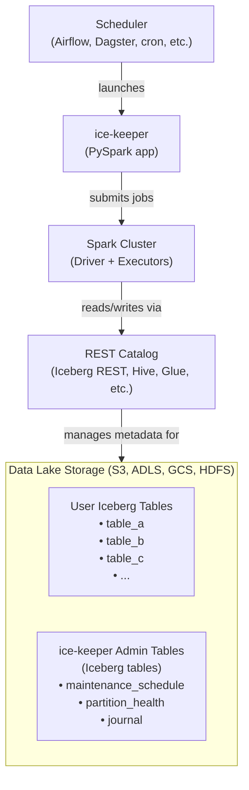

# ice-keeper

The Iceberg library provides stored procedures in Spark for table maintenance. Most of the time, these operations are the responsibility of data platform administrators.

ice-keeper is a CLI tool to automate Iceberg table maintenance of Iceberg tables.

ice-keeper can:

- discover new tables to manage
- expire old snapshots
- find and remove orphan files (not tracked by Iceberg), leveraging a storage inventory report to greatly speed up the process
- remove empty folders left behind after orphan file cleanup
- run an optimization on unhealthy partitions to improve search performance.

ice-keeper is designed to run maintenance on hundreds of tables concurrently and make better use of our spark resources.

ice-keeper is typically scheduled to run every night in Airflow, but it can be scheduled in your favorite scheduler (e.g., Airflow, Dagster, cron, or any other orchestration tool).

ice-keeper was inspired by this article [Automated Table Maintenance for Apache Iceberg Tables](https://www.starburst.io/blog/automated-table-maintenance-for-apache-iceberg/) and the associated [GitHub script](https://github.com/mdesmet/trino-iceberg-maintenance/blob/main/trino_iceberg_maintenance/__main__.py).

## Architecture


```mermaid
graph TD
    Scheduler["Scheduler<br/>(Airflow, Dagster, cron, etc.)"] -->|launches| IK
    IK["ice-keeper<br/>(PySpark app)"] -->|submits jobs| Spark["Spark Cluster<br/>(Driver + Executors)"]
    Spark -->|reads/writes via| Catalog["REST Catalog<br/>(Iceberg REST, Hive, Glue, etc.)"]
    Catalog -->|manages metadata for| Storage

    subgraph Storage["Data Lake Storage (S3, ADLS, GCS, HDFS)"]
        UserTables["User Iceberg Tables<br/>• table_a<br/>• table_b<br/>• table_c<br/>• ..."]
        AdminTables["ice-keeper Admin Tables<br/>(Iceberg tables)<br/>• maintenance_schedule<br/>• partition_health<br/>• journal"]
    end
```

**Key architectural points:**

- **No external server required.** ice-keeper is a PySpark application — if Spark can access and optimize a table, ice-keeper can manage it. The only infrastructure needed is a Spark platform with an Iceberg catalog.
- **All configuration is done via Spark.** ice-keeper connects to the same catalog and storage as any other Spark job. There is no separate database or service to deploy.
- **Admin tables are regular Iceberg tables.** The maintenance schedule, partition health reports, and journal are stored as Iceberg tables in the same catalog, queryable by any Spark user.
- **Simple architecture.** Spark cluster + Iceberg catalog + data lake storage. That's it.

## Monitoring

Since the admin tables (maintenance schedule, partition health, and journal) are regular Iceberg tables, you can easily build monitoring dashboards on top of them using your favorite presentation layer. Any tool that can query Iceberg tables — such as Superset/Trino, Grafana, or a Spark notebook — can be used to visualize maintenance activity, track failures, and monitor partition health over time.

For example:
- Query the **journal** table to track success/failure rates, execution times, and data file counts across all managed tables.
- Query **partition_health** to monitor which partitions are degraded and how they improve after optimization.
- Query **maintenance_schedule** to audit current configuration across your catalog.

No additional infrastructure is needed — if you can query Iceberg tables, you can monitor ice-keeper.

## Getting started

ice-keeper is executed from the command line and requires an action argument. The syntax is as follows: `ice-keeper <action>`. The available actions include:

| Action Name           | Description                                                                                                          |
| --------------------- | -------------------------------------------------------------------------------------------------------------------- |
| **schedule**          | View or modify the maintenance schedule.                                                                             |
| **discover**          | Identify new Apache Iceberg tables for management and update configurations of tables already tracked by ice-keeper. |
| **optimize**          | Enhance table performance using binpack, sort, or zorder strategies.                                                 |
| **expire**            | Remove outdated snapshots to preserve performance and manage storage.                                                |
| **orphan**            | Clean up orphaned data or metadata files that are no longer referenced.                                              |
| **rewrite_manifests** | Reorganize and streamline manifest files for better efficiency.                                                      |
| **lifecycle**         | Delete table data exceeding the configured retention period.                                                         |
| **diagnose**          | Diagnose table health by analyzing partitions (standalone, without running optimization).                            |
| **multi**             | Run multiple maintenance commands across multiple tables in a single invocation.                                     |
| **journal**           | Display logs of operations such as `optimize`, `expire`, `orphan`, and `rewrite_manifests`.                          |
| **reset**             | Drop and recreate ice-keeper admin tables (schedule, journal, partition health).                                     |
| **audit_config**      | Check table properties for typos or invalid ice-keeper configuration keys.                                           |
| **notify**            | Send email notifications for tables with consecutively failing maintenance tasks.                                    |

ice-keeper supports a variety of optional arguments, allowing customization of the actions. Usage is as follows: `ice-keeper [options] <action>`

| Optional Argument           | Description                                                                                                        |
| --------------------------- | ------------------------------------------------------------------------------------------------------------------ |
| **--config_file**           | Path to the YAML config file. Also reads from the `ICEKEEPER_CONFIG` environment variable.                         |
| **--catalog**               | Restrict the scope of the action to the specified catalog.                                                         |
| **--schema**                | Restrict the scope of the action to the specified schema.                                                          |
| **--table_name**            | Restrict the scope of the action to the specified table.                                                           |
| **--where**                 | Apply an ad-hoc filter to determine the scope of the action, e.g., `--where "full_name = 'dev_catalog.schema2.table4'"`. |
| **--set**                   | Used exclusively by the `schedule` action to specify which columns to modify and their new values.                 |
| **--spark_master**          | The Spark master URL (default: `local`).                                                                           |
| **--spark_executors**       | Define the number of Spark executors desired. Setting this to zero will run the process using only a Spark driver.  |
| **--spark_executor_cores**  | Specify the number of CPU cores allocated to each executor instance.                                               |
| **--spark_executor_memory** | Define the RAM size allocated to each executor, e.g., `16g`.                                                       |
| **--spark_driver_cores**    | Specify the number of CPU cores allocated to the Spark driver.                                                     |
| **--spark_driver_memory**   | Define the RAM size allocated to the Spark driver, e.g., `8g`.                                                     |
| **--concurrency**           | Set the number of tables to be processed in parallel.                                                              |

## Action: discover

Running the discovery process will populate the `maintenance_schedule` table.

```bash
./ice-keeper discover  --catalog dev_catalog --schema jcc
```

The discovery process instructs ice-keeper to scans all catalogs and schemas. For each new table detected, it creates a new entry in ice-keeper's maintenance schedule. If the entry already exists, ice-keeper makes sure that any user overrides are taken into consideration. User overrides are special tblproperties specific to ice-keeper.

Conversely, for any table that had an entry in the maintenance schedule but is no longer is present in the Iceberg catalog ice-keeper will remove that entry from its maintenance schedule.

In a nutshell the discover action syncs the information found in the catalog with it's maintenance schedule.


Internally ice-keeper uses a table called `maintenance_schedule` and is initially empty. This table holds the following configuration columns:

| column name                          | description                                                                 |
| ------------------------------------ | --------------------------------------------------------------------------- |
| full_name                            | Fully qualified table name (catalog.schema.table).                          |
| catalog                              | Catalog name.                                                               |
| schema                               | Schema name.                                                                |
| table_name                           | Table name.                                                                 |
| partition_by                         | Partition specification of the table.                                       |
| should_expire_snapshots              | Whether ice-keeper should expire old snapshots.                             |
| retention_days_snapshots             | Number of days of snapshots to retain.                                      |
| retention_num_snapshots              | Minimum number of snapshots to keep.                                        |
| should_remove_orphan_files           | Whether ice-keeper should remove orphan files.                              |
| retention_days_orphan_files          | Orphan files younger than this (days) are not deleted.                      |
| should_optimize                      | Whether the table should be optimized.                                      |
| optimization_strategy                | Strategy: binpack, sort columns, or zorder(cols).                           |
| optimize_partition_depth             | Number of partition levels for grouping (-1 = dynamic).                     |
| optimization_grouping_size_bytes     | Max bytes per optimization group (dynamic grouping).                        |
| min_partition_to_optimize            | Min partition offset for the diagnostic window (e.g., `1d`).                |
| max_partition_to_optimize            | Max partition offset for the diagnostic window (e.g., `7d`).                |
| target_file_size_bytes               | Target file size (-1 = automatic).                                          |
| binpack_min_input_files              | Min files to trigger a binpack.                                             |
| sort_corr_threshold                  | Correlation threshold for sort health (testing only).                       |
| optimization_quota_hours             | Max hours allowed for optimizing a single table.                            |
| should_rewrite_manifest              | Whether to rewrite manifest files.                                          |
| should_apply_lifecycle               | Whether to apply lifecycle data deletion.                                   |
| lifecycle_max_days                   | Max days to retain data for lifecycle.                                      |
| lifecycle_ingestion_time_column      | Column used as ingestion timestamp for lifecycle.                           |
| widening_rule_src_partition          | Source partition for widening.                                              |
| widening_rule_dst_partition          | Destination partition for widening.                                         |
| widening_rule_min_partition_to_widen | Min offset to start widening.                                               |
| widening_rule_max_partition_to_widen | Max offset to consider for widening.                                        |
| widening_rule_select_criteria        | Row selection criteria for widening.                                        |
| widening_rule_required_partition_columns | Columns that must not be NULL before widening.                          |
| notification_email                   | Email address for failure notifications.                                    |
| last_updated_by                      | Identity that last modified this entry.                                     |
| table_location                       | Storage location of the table.                                              |

_Table 1: maintenance_schedule table_

### How the discovery action works

To explain the discovery process we will use a single configuration namely `should_expire_snapshots`. This configuration defaults to true, unless the user specifically overrides it with a tblproperty `ice-keeper.should-expire-snapshots`.

| configuration           | tblproperty                        | default |
| ----------------------- | ---------------------------------- | ------- |
| should_expire_snapshots | ice-keeper.should-expire-snapshots | true    |

Let's suppose a user wrote an anlytic and stores the results into an Iceberg table called `cyber_detections`. The table might have been created as follows:

```sql
   create or replace table dev_catalog.jcc.cyber_detections
   (event_time timestamp, id long, col1 string)
   using iceberg
   partitioned by (days(event_time))
   tblproperties(
      'write.format.default'='parquet'
   )

```

Running this command `ice-keeper discover --catalog dev_catalog` will launch the discovery process. ice-keeper will find this new table and include it into it's maintenance schedule. We see that `should_expire_snapshots` is set to true because that's the default value for this configuration.

| full_name          | should_expire_snapshots | retention_days_snapshots | should_remove_orphan_files | retention_days_orphan_files |
| ------------------ | ----------------------- | ------------------------ | -------------------------- | --------------------------- |
| ..cyber_detections | true                    | 7                        | true                       | 5                           |

Every night ice-keeper is launched to expire snapshots process and use the maintenance schedule.

If a user want's to opt-out of this behavior they can override the configuration by either creating their table like this:

```sql
   create or replace table dev_catalog.jcc.cyber_detections
   (event_time timestamp, id long, col1 string)
   using iceberg
   partitioned by (days(event_time))
   tblproperties(
      'write.format.default'='parquet',
      'ice-keeper.should-expire-snapshots'='false'
   )

```

Or alternatively at any time they can modify the table's properties like this:

```sql
alter table dev_catalog.jcc.cyber_detections
set tblproperties ('ice-keeper.should-expire-snapshots'='false')
```

It's easy to check what are the tblproperties of an Iceberg table:

```sql
show tblproperties dev_catalog.jcc.cyber_detections
```


```sql
alter table dev_catalog.jcc.cyber_detections
unset tblproperties ('ice-keeper.should-expire-snapshots')
```

## Showing Maintenance Schedule Changes Over Time

Iceberg records changes made to tables via a history of snapshots (commits). We can leverage this feature to inspect what changes were made to the maintenance schedule. These changes can be done via the discovery process or manually by an administrator. Either way a change is made to the maintenance schedule and can thus be retrieved via the Iceberg [create_changelog_view](https://iceberg.apache.org/docs/nightly/spark-procedures/#create_changelog_view) procedure.

Let us suppose we ran this command to update the maintenance schedule:

```bash
./ice-keeper \
   --where " full_name = 'dev_catalog.admin.ice_keeper_maintenance_schedule' " \
   schedule \
   --set " retention_days_snapshots = 90 " \
```

Now we want to find what has changed in the last hour. To do so we create a view of changes bound to the last hour by passing in a start-timetamp.
We also need to specify a row-key (what makes our row unique). We pass in the catalog, schema, table_name.

```sql
%%sparksql
CALL dev_catalog.system.create_changelog_view(
  table => 'admin.ice_keeper_maintenance_schedule',
  options => map('start-timestamp','1736881275000'),
  changelog_view => 'ice_keeper_maintenance_schedule_changes',
  identifier_columns => array('catalog', 'schema', 'table_name', 'full_name')
)
```

Now that we have a view of changes we can display and query this view.

```sql
%%sparksql
select
  full_name,
  retention_days_snapshots,
  _change_type,
  _change_ordinal,
  _commit_snapshot_id
from
  ice_keeper_maintenance_schedule_changes
order by
  _change_ordinal asc,
  _change_type desc

```

This will show the changes to the column `retention_days_snapshots`
|last_updated_by| retention_days_snapshots| \_change_type| \_change_ordinal| \_commit_snapshot_id
|-|-|-|-|-|
|jupyhub/jcc| 91| UPDATE_BEFORE| 0| 4563331490714018710
|jupyhub/jcc| 90 |UPDATE_AFTER| 0 |4563331490714018710

The create_changelog_view adds 3 additional columns (`_change_type`, `_change_ordinal`, `_commit_snapshot_id`) which are explained in details [here](https://iceberg.apache.org/docs/nightly/spark-procedures/#create_changelog_view).

If we want to see the `committed_at` time rather than the snapshot ID we can join with the `.snapshot` metadata table.

```sql
%%sparksql
select
  full_name,
  retention_days_snapshots,
  _change_type,
  _change_ordinal,
  s.committed_at
from
  ice_keeper_maintenance_schedule_changes as c
  left join dev_catalog.admin.ice_keeper_maintenance_schedule.snapshots as s
  on (c._commit_snapshot_id = s.snapshot_id)
order by
  _change_ordinal asc,
  _change_type desc

```

## The Journal Action

In addition to using the Python logging mechanism, ice-keeper also writes the result of each individual action performed on the managed tables. All actions are logged in the `journal` table. The actions use a common set of columns and some columns are specific to the action.

| Common column name | Description                                                                                                          |
| ------------------ | -------------------------------------------------------------------------------------------------------------------- |
| full_name          | Fully qualified name of the table operated on.                                                                       |
| catalog            | Catalog name.                                                                                                        |
| schema             | Schema name.                                                                                                         |
| table_name         | Table name.                                                                                                          |
| start_time         | Time the action was started.                                                                                         |
| end_time           | Time the action completed.                                                                                           |
| exec_time_seconds  | Execution duration in seconds.                                                                                       |
| sql_stm            | **The complete SQL procedure call that was executed**, including all arguments.                                        |
| status             | Status of the execution: `SUCCESS`, `FAILED`, or `WARNING`.                                                          |
| status_details     | Additional details such as the exception stack trace on failure.                                                      |
| executed_by        | Identity that executed this action.                                                                                  |
| action             | The action taken: `rewrite_data_files`, `expire_snapshots`, `rewrite_manifests`, `remove_orphan_files`, `lifecycle`. |

| Used by rewrite_data_files | Description                                         |
| -------------------------- | --------------------------------------------------- |
| rewritten_data_files_count | Number of data files rewritten.                     |
| added_data_files_count     | Number of new data files created.                   |
| rewritten_bytes_count      | Total bytes rewritten.                              |
| failed_data_files_count    | Number of data files that failed to rewrite.        |
| removed_delete_files_count | Number of delete files removed during compaction.   |

| Used by expire_snapshots            | Description                                    |
| ----------------------------------- | ---------------------------------------------- |
| deleted_data_files_count            | Number of data files deleted.                  |
| deleted_position_delete_files_count | Number of position delete files deleted.       |
| deleted_equality_delete_files_count | Number of equality delete files deleted.       |
| deleted_manifest_files_count        | Number of manifest files deleted.              |
| deleted_manifest_lists_count        | Number of manifest lists deleted.              |
| deleted_statistics_files_count      | Number of statistics files deleted.            |

| Used by rewrite_manifests | Description                          |
| ------------------------- | ------------------------------------ |
| rewritten_manifests_count | Number of manifests rewritten.       |
| added_manifests_count     | Number of new manifests created.     |

| Used by remove_orphan_files | Description                                    |
| --------------------------- | ---------------------------------------------- |
| num_orphan_files_deleted    | Number of files deleted by remove_orphan_files.|

| Used by lifecycle           | Description                                         |
| --------------------------- | --------------------------------------------------- |
| lifecycle_deleted_data_files     | Number of data files deleted by lifecycle.      |
| lifecycle_deleted_records        | Number of records deleted by lifecycle.         |
| lifecycle_changed_partition_count| Number of partitions affected by lifecycle.     |

_Table 2: journal table_

> **FYI:** The `sql_stm` column contains the full procedure call with all arguments, for example:
> ```sql
> CALL catalog.system.rewrite_data_files(
>   table => 'catalog.schema.my_table',
>   strategy => 'sort',
>   sort_order => 'id ASC',
>   where => 'event_time >= ...',
>   options => map('target-file-size-bytes', '536870912')
> )
> ```
> This lets you see exactly what ice-keeper ran and copy-paste it to re-run manually if needed.

The journal can be printed using the `journal` action. This command will show expire_snapshots runs on schema1.

```bash
./ice-keeper journal \
    --where " catalog = 'dev_catalog' and schema = 'schema1' and action = 'expire_snapshots' "
```

## The Schedule Action

The maintenance schedule can be printed using the `schedule` action. This command will show the maintenace schedule of the dev_catalog.schema1 tables.

```bash
./ice-keeper schedule \
    --where " catalog = 'dev_catalog' and schema = 'schema1' and table_name like 'telemetry%' "
```

## The Expire Action

In Apache Iceberg, every change to the data in a table creates a new version, called a snapshot. Iceberg metadata keeps track of multiple snapshots at the same time to give readers using old snapshots time to complete, to enable incremental consumption, and for time travel queries.

Of course, keeping all table data indefinitely isn’t practical. Part of basic Iceberg table maintenance is to expire old snapshots to keep table metadata small and avoid high storage costs from data files that aren’t needed. Snapshots accumulate until they are expired.

Expiration is configured with two settings:

- **Maximum snapshot age** (`ice-keeper.retention-days-snapshots`, default: 7 days): a time window beyond which snapshots are discarded.
- **Minimum number of snapshots to keep** (`ice-keeper.retention-num-snapshots`, default: 1): a minimum number of snapshots to keep in history. As new ones are added, the oldest ones are discarded.

ice-keeper only runs expire on tables where `should_expire_snapshots` is enabled and the table has been recently modified (i.e., new snapshots exist).

Internally, ice-keeper calls the Iceberg `expire_snapshots` procedure:

```sql
CALL catalog.system.expire_snapshots(
  table => 'schema.table_name',
  older_than => timestamp '2026-05-01 00:00:00',
  retain_last => 1,
  stream_results => true
)
```

This command runs the expire action:

```bash
./ice-keeper expire --where " full_name = 'dev_catalog.schema1.telemetry_1' "
```

## The Orphan Action

Cleaning up orphan files — data files that are not referenced by table metadata — is an important part of table maintenance that reduces storage expense.

What are orphan files and what creates them?
Orphan files are files in the table’s data directory that are not part of the table state. As the name suggests, orphan files aren’t tracked by Iceberg, aren’t referenced by any snapshots in a table’s snapshot log, and are not used by queries.

Orphan files come from failures in the distributed systems that write to Iceberg tables. For example, if a Spark driver runs out of memory and crashes after some tasks have successfully created data files, those files will be left in storage, but will never be committed to the table.

#### The challenge with orphan files

Orphan files accumulate over time; if they’re not referenced in table metadata they can’t be removed by normal snapshot expiration. As they accumulate, storage costs continue to add up so it’s a good idea to find and delete them regularly. The recommended best practice is to run orphan file cleanup weekly or monthly.

Deleting orphan files can be tricky. It requires comparing the full set of referenced files in a table to the current set of files in the underlying object store. This also makes it a resource-intensive operation, especially if you have a large volume of files in data and metadata directories.

In addition, files may appear orphaned when they are part of an ongoing commit operation. Iceberg uses optimistic concurrency, so writers will create all of the files that are part of an operation before the commit. Until the commit succeeds, the files are unreferenced. To avoid deleting files that are part of an ongoing commit, maintenance procedures use an `olderThan` argument. The retention is controlled by `ice-keeper.retention-days-orphan-files` (default: 5 days).

#### Leveraging a storage inventory report

By default, the Iceberg `remove_orphan_files` procedure lists all files in the table's storage directory to find orphans. This can be very slow and expensive for large tables.

When a storage inventory report is configured, ice-keeper uses it to greatly speed up orphan file detection. Instead of listing the object store at runtime, ice-keeper queries the pre-built inventory to get the list of existing files and passes it to the procedure via the `file_list_view` parameter.

The inventory is also used to **detect and remove empty folders** left behind after file deletions. ice-keeper identifies leaf folders (folders that are not a parent of any other entry) with zero-byte size and includes them in the file list so they get cleaned up along with orphan data files.

#### Debugging with the logged SQL

ice-keeper logs the SQL statements it uses to build the file list from the inventory. These include:
- The query to find data files (`.parquet`, `.avro`, `.json`) under the table's `data/` and `metadata/` directories
- The query to find empty leaf folders

You can copy and paste these SQL statements from the logs to investigate exactly how ice-keeper determines which files to feed to the `remove_orphan_files` procedure.

Internally, ice-keeper calls the Iceberg `remove_orphan_files` procedure:

```sql
CALL catalog.system.remove_orphan_files(
  table => 'schema.table_name',
  older_than => timestamp '2026-05-01 00:00:00',
  file_list_view => 'file_list_view',
  dry_run => false
)
```

This command runs the orphan action:

```bash
./ice-keeper orphan --where " full_name = 'dev_catalog.schema1.telemetry_1' "
```

## The Rewrite Manifest Action

This command runs the rewrite_manifests action, which runs the Iceberg `rewrite_manifests` procedure.

```bash
./ice-keeper rewrite_manifests --where " full_name = 'dev_catalog.schema1.telemetry_1' "
```

## The Optimize Action

The primary motivation for creating Apache Iceberg was to make transactions safe and reliable. Without safe concurrent writes, pipelines have just one opportunity to write data to a table. Unnecessary changes are risky: queries might produce results from bad data and writers could permanently corrupt a table. In short, write jobs are responsible for too much and must make tradeoffs, often leading to lingering performance issues like the "small files" problem.

With the reliable updates Iceberg provides, you can break down data preparation into separate tasks. Writers are responsible for transformation and making the data available quickly. Performance optimizations like compaction are applied later as background tasks.

File compaction is not just a solution for the small files problem. Compaction rewrites data files, which is an opportunity to also recluster, repartition, and remove deleted rows.

### Optimization strategies

ice-keeper supports three optimization strategies, controlled by the `ice-keeper.optimization-strategy` table property:

- **`binpack`** — Compacts small files without reordering. Only rewrites files that are outside the 0.5x–2.0x target size range. Files that are already the right size are left untouched (`rewrite-all: false`).
- **Sort** (e.g., `id ASC, ts DESC`) — Rewrites all data files sorted by the specified columns (`rewrite-all: true`). Improves query performance for range filters on the sort columns.
- **Z-order** (e.g., `zorder(src_ip, dst_ip)`) — Rewrites all data files with Z-order interleaving on the specified columns (`rewrite-all: true`). Improves query performance when filters can appear on any combination of the Z-ordered columns.

### Target file size

The target file size is controlled by `ice-keeper.optimization-target-file-size-bytes` (default: `-1`, which means **automatic**).

When set to `-1`, ice-keeper automatically selects a target file size per partition based on the total data size of that partition. This is the recommended setting. See the user documentation for the full sizing table.

When set to a specific byte value (e.g., `536870912` for 512 MB), that fixed size is used for all partitions.

> **Note:** The native Iceberg property `write.target-file-size-bytes` is **not** used by ice-keeper. If you want ice-keeper to optimize with the same target size as your write configuration, you must explicitly set `ice-keeper.optimization-target-file-size-bytes`.

### Diagnostic window

The optimize action first runs a diagnostic on each partition within the configured window (`ice-keeper.min-partition-to-optimize` to `ice-keeper.max-partition-to-optimize`) to assess partition health. Only partitions that actually need optimization are rewritten.

The health assessment depends on the strategy:
- **Binpack**: a partition needs optimization when more than 10% of its files are outside the target size range and the count exceeds `ice-keeper.binpack-min-input-files` (default: 5), or when delete files are present.
- **Sort**: a partition needs optimization when the correlation (`corr`) between file ordering and the sort order drops below the threshold (default: 0.97), or when delete files are present.
- **Z-order**: same as sort, but uses a dynamic correlation threshold based on the number of files in the partition.

### Partition grouping

The `ice-keeper.optimize-partition-depth` property (default: `-1`, dynamic grouping) controls how partitions are grouped for optimization calls:
- **Dynamic grouping** (`-1`): automatically bundles sub-partitions into groups up to `ice-keeper.optimization-grouping-size-bytes` (default: 16 GB) per `rewrite_data_files` call.
- **Fixed depth** (e.g., `1`, `2`): groups partitions by the first N partition levels.

### Time budget

The `ice-keeper.optimization-quota-hours` property (default: 6) sets a time budget per table. If optimization runs longer than this, ice-keeper stops and continues with the next table.

### Skipping already-optimized partitions

ice-keeper tracks partition health in the `partition_health` table. If a partition's `max_file_sequence_number` hasn't changed since the last successful optimization (within the last 30 days), it is skipped to avoid redundant work.

### Invoking the optimize action

```bash
./ice-keeper optimize --where " full_name = 'dev_catalog.schema1.telemetry_1' "
```

Internally, ice-keeper calls the Iceberg `rewrite_data_files` procedure:

```sql
CALL catalog.system.rewrite_data_files(
  table => 'schema.table_name',
  strategy => 'sort',
  sort_order => 'id ASC, ts DESC',
  where => 'event_time >= ...',
  options => map(
    'target-file-size-bytes', '536870912',
    'rewrite-all', 'true'
  )
)
```

### Partition health table

After running optimizations, ice-keeper stores a before/after report of partition health in the `partition_health` table. This table uses a nested struct format with `before` and `after` columns:

| Column name    | Description                                                                    |
| -------------- | ------------------------------------------------------------------------------ |
| start_time     | Timestamp of the optimization run.                                             |
| full_name      | Fully qualified table name.                                                    |
| catalog        | Catalog name.                                                                  |
| schema         | Schema name.                                                                   |
| table_name     | Table name.                                                                    |
| partition_desc | Partition description (e.g., `event_time_day=2026-01-15`).                     |
| partition_age  | Age rank of the partition relative to the most recent.                          |
| optimized      | Whether the partition was actually optimized (sequence number changed).         |
| before / after | Structs containing: `n_files`, `num_files_targetted_for_rewrite`, `n_records`, `avg_file_size`, `min_file_size`, `max_file_size`, `sum_file_size`, `corr`, `max_file_sequence_number`. |

_Table 3: partition_health table_

## The Diagnosis Action

As part of the optimization process, ice-keeper first runs a diagnostic on the table to identify partitions that require optimization. You can also invoke the diagnosis action manually on any table, even if it is not yet configured for optimization. This is useful for verifying whether a table would benefit from being maintained by ice-keeper.

### What the diagnosis does

The diagnosis evaluates partition health by running a large SQL query against the table's `data_files` metadata. For each partition (within the configured window), it computes:

- **File count and sizes** — number of files, average/min/max/sum file size
- **Files targeted for rewrite** — files outside the 0.5x–2.0x target size range
- **Correlation (`corr`)** — how well-sorted the data files are (1.0 = perfectly sorted)
- **Delete files** — count of delete files and delete records
- **Sequence number** — `max_file_sequence_number` for skip-already-optimized tracking
- **`should_optimize`** — a boolean flag indicating whether the partition needs optimization

The `should_optimize` flag depends on the strategy:
- **Binpack**: true when more than 10% of files are outside the target size range and the count exceeds `binpack_min_input_files` (default: 5), or when delete files are present.
- **Sort**: true when `corr < corr_threshold` (default: 0.97), or when delete files are present.
- **Z-order**: true when `corr < dynamic_threshold` (threshold varies based on the number of files in the partition).

### Diagnostic logging

ice-keeper logs all diagnostic SQL statements and their results at the DEBUG log level. This makes it possible to copy/paste the diagnostic output and investigate the behavior of the health evaluation in detail. Specifically, the logs include:

1. **The full diagnostic SQL** — pretty-printed via `sqlparse`, showing the complete CTE chain that computes partition health metrics
2. **The partition summary table** — a formatted table showing every partition with its `n_files`, `num_files_targetted_for_rewrite`, `target_file_size`, `avg_file_size`, `corr`, `corr_threshold`, `n_delete_files`, `should_optimize`, and human-readable sizes
3. **The partitions selected for optimization** — which partitions passed the threshold and will be optimized, grouped by the configured partition depth or dynamic grouping

By reading the diagnostic output you can clearly see the thought process ice-keeper is following: which SQL was executed, what thresholds were applied, what the correlation factor is for each partition, how many files are at the target size, and why each partition was or was not selected for optimization.

> **Tip:** Set the logging level to `DEBUG` in your `logging_config.yaml` to see the full diagnostic output. You can then redirect the output to a file for analysis.

### Running the diagnosis manually

```bash
ICEKEEPER_CONFIG=./config/ice-keeper.yaml \
  ./ice-keeper diagnose \
  --full_name dev_catalog.schema1.table1 \
  --max_partition_to_diagnose 30d \
  --optimization_strategy 'address ASC NULLS FIRST, id DESC'
```

Available options:

| Option | Description |
| --- | --- |
| `--full_name` | Fully qualified table name (required). |
| `--min_partition_to_diagnose` / `--max_partition_to_diagnose` | Time-based partition range (e.g., `1d`, `7d`, `1M`). |
| `--min_age_to_diagnose` / `--max_age_to_diagnose` | Age-based partition range (integer rank). Mutually exclusive with time-based range. |
| `--optimization_strategy` | Override the strategy (e.g., `binpack`, `id ASC`, `zorder(col1, col2)`). |
| `--target_file_size_bytes` | Override target file size. |
| `--sort_corr_threshold` | Override the correlation threshold. |
| `--binpack_min_input_files` | Override the minimum input files for binpack. |
| `--optimize_partition_depth` | Override partition grouping depth. |
| `--optimization_grouping_size_bytes` | Override dynamic grouping size. |

The `--optimization_strategy` option accepts the same values as the table property `ice-keeper.optimization-strategy`.

## Spark Resource Allocation

The expire action runs both `expire_snapshots` and `rewrite_manifests` procedures. Both of these procedures do not use the Spark workers. Thus we configure ice-keeper to run with `--spark_executors 0`. However, `rewrite_manifests` can take quite a bit of memory on certain tables, thus we run it with plenty of RAM (`--spark_driver_memory 32g`).

```bash
./ice-keeper expire \
    --concurrency 32 \
    --spark_driver_cores 16 \
    --spark_driver_memory 16g \
    --spark_executors 10 \
    --spark_executor_cores 10 \
    --spark_executor_memory 10g \
    --where "$where"
```

The orphan action runs a `remove_orphan_files` procedure which runs on Spark workers. This procedure builds a list of existing files (right side) and a list of tracked files (left side). It then joins these two tables to find un-tracked files and deletes them. Since all this work is done on Spark workers, we can scale execution to hundreds of concurrent tables.

```bash
./ice-keeper orphan \
    --concurrency 8 \
    --spark_driver_cores 16 \
    --spark_driver_memory 32g \
    --spark_executors 10 \
    --spark_executor_cores 10 \
    --spark_executor_memory 10g \
    --where "$where"
```

## Development Setup

### Prerequisites

- Python 3.10+
- [uv](https://docs.astral.sh/uv/) (installed automatically by `make install`)
- Java 11+ (required by Spark)

### Installation

This will install `uv` to a private virtual environment in `~/.local`, sync the project's dependencies, and download the Iceberg Spark runtime JAR:

```bash
make install
```

### IDE setup (code-server / VS Code)

1. Disable all extensions:


2. Search for the project's recommended extensions:


You may need to run the search a few times before code-server finds the recommended extensions.

3. Enable the recommended extensions for your workspace:


### Project structure

```
ice_keeper/              # Main package
  ice_keeper.py          # CLI entry point (Click commands)
  config.py              # Configuration loading
  catalog.py             # Catalog management
  task/                  # Task framework
    action/              # Maintenance actions (optimize, expire, orphan, ...)
      optimization/      # Optimization logic (diagnosis, partition grouping, ...)
  spec/                  # Specifications (optimization, partition, transformation, ...)
  table/                 # Admin tables (journal, schedule, partition_health)
  templates/             # SQL/Jinja2 templates
tests/
  unit/                  # Unit tests (no Spark)
  integration/           # Integration tests (local Spark + Iceberg)
  config/                # Test configuration files
```

### Running tests

Tests are managed with `pytest` and split into two categories:

**Unit tests** run without Spark and test pure Python logic (config parsing, discovery, email, z-order calculations, etc.):

```bash
make unit-test
```

**Integration tests** run with a local Spark session and a local Hadoop catalog on the local filesystem. They create real Iceberg tables with properties, insert data, and run maintenance actions (optimize, expire, orphan, rewrite, discovery, widening, etc.):

```bash
make integration-test
```

All tests work fully offline — no cloud infrastructure or remote catalogs are needed. The test fixtures automatically set up a local Spark session with Iceberg extensions and a temporary warehouse directory on the local disk.

To run all tests:

```bash
make all-test
```

### Linting and formatting

```bash
make lint          # Run ruff check + mypy
make format        # Auto-format with ruff
make format-check  # Check formatting without modifying
```

### Pre-commit check

Run all checks (formatting, linting, tests) before committing:

```bash
make precommit
```

## Execution Plans and Resource Allocations

### Expire

The expire_snapshots procedure reads the uses the all_manifests see BatchScan(5 and 17). It then aggregates and union these lists.

Once this is done the driver uses a toLocalIterator and seems like the driver deletes the snapshots based on this iterator. When the driver calls toLocalIterator the workers use all their cpu to execute this plan (50 cpu are put to work)
on the driver side it deletes using threads and can utilize 30 cpu.

it uses broacast hash join and I have seen it
Job aborted due to stage failure: Total size of serialized results of 468 tasks (4.0 GiB) is bigger than spark.driver.maxResultSize (4.0 GiB)
AdaptiveSparkPlan (40)

So I have configured the driver to allow results up to 4G. I have also increased the shuffle partitions from 200 to 800. This creates smaller tasks since datasets are split in 800 tasks rather than 200.

```
.config("spark.sql.shuffle.partitions", "800")
.config("spark.driver.maxResultSize", "4g")
```

Here is the execution plan of the expire_snapshots procedure:

```
+- == Current Plan ==
   HashAggregate (25)
   +- Exchange (24)
      +- HashAggregate (23)
         +- BroadcastHashJoin LeftAnti BuildRight (22)
            :- SerializeFromObject (4)
            :  +- MapPartitions (3)
            :     +- DeserializeToObject (2)
            :        +- LocalTableScan (1)
            +- BroadcastExchange (21)
               +- Union (20)
                  :- SerializeFromObject (16)
                  :  +- MapPartitions (15)
                  :     +- DeserializeToObject (14)
                  :        +- ShuffleQueryStage (13)
                  :           +- Exchange (12)
                  :              +- * HashAggregate (11)
                  :                 +- AQEShuffleRead (10)
                  :                    +- ShuffleQueryStage (9), Statistics(sizeInBytes=177.3 MiB, rowCount=7.49E+5)
                  :                       +- Exchange (8)
                  :                          +- * HashAggregate (7)
                  :                             +- * Project (6)
                  :                                +- BatchScan abfss://warehouse@mydatalake.dfs.core.windows.net/iceberg/schema1/telemetry/metadata/320826-59c74ee4-e849-4067-9b91-6fbe5f249b32.metadata.json#all_manifests (5)
                  :- Project (18)
                  :  +- BatchScan abfss://warehouse@mydatalake.dfs.core.windows.net/iceberg/schema1/telemetry/metadata/320826-59c74ee4-e849-4067-9b91-6fbe5f249b32.metadata.json#all_manifests (17)
                  +- LocalTableScan (19)
```

### rewrite_manifest

LocalTableScan (see 4 below) seems to be the list of manifest files in a streaming table (7 days of snapshots) can be 1000s with a size of 10MB
BatchScan (see 1 below) reads `dev_catalog.schema1.table1.entries` (current entries, not on all_entries). The number of entries in a table can get quite hight, especially when the table is written to using a spark streaming job. It can reach 100 of thousands (for a table with 6 months of retention).

Typically not a large spark job but still can benefit from running on the spark cluster.

The execution plan of a rewrite_manifest procedure:

```
AdaptiveSparkPlan (24)
+- == Final Plan ==
   * SerializeFromObject (14)
   +- MapPartitions (13)
      +- DeserializeToObject (12)
         +- * Sort (11)
            +- ShuffleQueryStage (10), Statistics(sizeInBytes=19.7 MiB, rowCount=5.70E+3)
               +- Exchange (9)
                  +- * Project (8)
                     +- * BroadcastHashJoin LeftSemi BuildRight (7)
                        :- * Project (3)
                        :  +- * Filter (2)
                        :     +- BatchScan dev_catalog.schema1.sa_beacon.entries (1)
                        +- BroadcastQueryStage (6), Statistics(sizeInBytes=8.0 MiB, rowCount=373)
                           +- BroadcastExchange (5)
                              +- LocalTableScan (4)
```

### Orphans

The remove_orphan_files procedures builds a list of existing files (right side). It also builds a list of tracked files (left side). These tables are then join to find the un-tracked files.
This job can fail because of too large broadcast join. I've change the spark configuration to disable broadcast and favor sort merge join which will never fail. There is probably a very small cost to using a sort merge join for smaller tables but I suspect very small and it's a small price to pay for stability accross all tables. The ExpireSnapshotTask sets this `self.spark.conf.set("spark.sql.autoBroadcastJoinThreshold", "-1")`

Once the list of un-tracked files is deteremine they are deleted I believe by the workers (needs to be confirmed).
Since all this work is done on workers we can scale this procedure to 100s of concurrent tables.

There seems to be a first phase where the procedure reads the metadata files but not using a spark task, i.e.: I see it running in the spark UI but I don't see tasks for these so hard to tell how well they use the
CPUs..

Execution plan of a remove_orphan_file procedure.

```
AdaptiveSparkPlan (86)
+- == Final Plan ==
   * SerializeFromObject (51)
   +- MapPartitions (50)
      +- DeserializeToObject (49)
         +- * SortMergeJoin LeftOuter (48)
            :- * Sort (8)
            :  +- AQEShuffleRead (7)
            :     +- ShuffleQueryStage (6), Statistics(sizeInBytes=223.8 KiB, rowCount=578)
            :        +- Exchange (5)
            :           +- * Project (4)
            :              +- * SerializeFromObject (3)
            :                 +- MapPartitions (2)
            :                    +- Scan (1)
            +- * Sort (47)
               +- AQEShuffleRead (46)
                  +- ShuffleQueryStage (45), Statistics(sizeInBytes=583.9 KiB, rowCount=1.56E+3)
                     +- Exchange (44)
                        +- Union (43)
                           :- * Project (23)
                           :  +- * Filter (22)
                           :     +- * SerializeFromObject (21)
                           :        +- MapPartitions (20)
                           :           +- MapPartitions (19)
                           :              +- DeserializeToObject (18)
                           :                 +- ShuffleQueryStage (17), Statistics(sizeInBytes=44.3 KiB, rowCount=227)
                           :                    +- Exchange (16)
                           :                       +- * HashAggregate (15)
                           :                          +- AQEShuffleRead (14)
                           :                             +- ShuffleQueryStage (13), Statistics(sizeInBytes=53.2 KiB, rowCount=227)
                           :                                +- Exchange (12)
                           :                                   +- * HashAggregate (11)
                           :                                      +- * Project (10)
                           :                                         +- BatchScan dev_catalog.schema1.telemetry1.all_manifests (9)
                           :- * Project (30)
                           :  +- * Filter (29)
                           :     +- * SerializeFromObject (28)
                           :        +- MapPartitions (27)
                           :           +- DeserializeToObject (26)
                           :              +- * Project (25)
                           :                 +- BatchScan dev_catalog.schema1.telemetry1.all_manifests (24)
                           :- * Project (36)
                           :  +- * Filter (35)
                           :     +- * SerializeFromObject (34)
                           :        +- MapPartitions (33)
                           :           +- DeserializeToObject (32)
                           :              +- LocalTableScan (31)
                           +- * Project (42)
                              +- * Filter (41)
                                 +- * SerializeFromObject (40)
                                    +- MapPartitions (39)
                                       +- DeserializeToObject (38)
                                          +- LocalTableScan (37)
```

