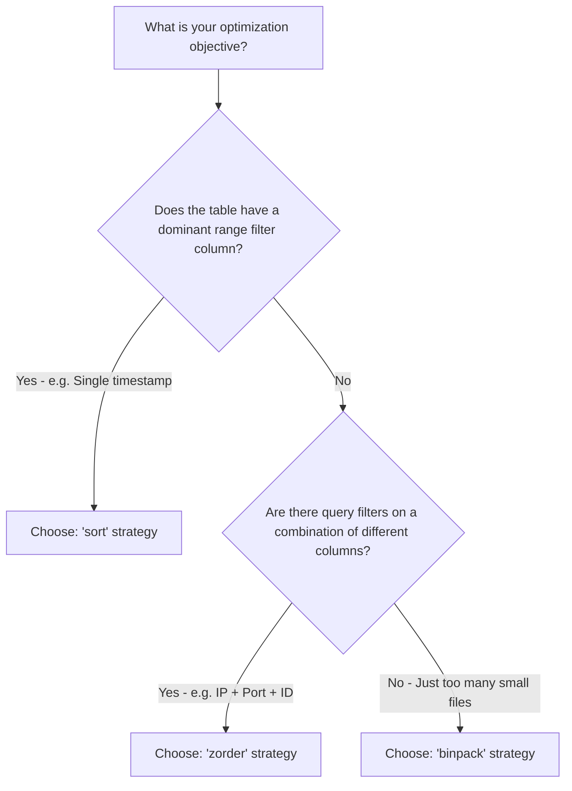

# User Guide for Ice-Keeper (DRAFT)


[Apache Iceberg](https://iceberg.apache.org/) tables require regular operational maintenance. This may be unexpected for individuals who are new to Iceberg-based data architectures. While historic formats (like Hive) often required rigid pipelines to manage file sizes and partition layouts during initial writes, Iceberg allows for highly efficient decoupled writes and background maintenance.

There are three key reasons why table maintenance is crucial in Iceberg:

1. **Background Compaction / Small Files Resolution**: Iceberg enables concurrent background updates safely. Writers are freed from balancing immediate data availability with long-term file layout performance. Instead, streaming or batch ingest pipelines can write frequently, creating small files designed for quick commits, while background processes asynchronously compact and cluster them into large, query-efficient files.
2. **Snapshot Expiration & Storage Reclamation**: Iceberg utilizes an optimistic concurrency model, writing immutable data files and committing new snapshots. Old data and delete files remain stored in the underlying lakehouse store to support active readers, time travel, and incremental processing. These snapshots must be expired periodically to reclaim storage and prune metadata.
3. **Orphan File Sweep**: Job failures or driver crashes in distributed frameworks (like Spark) can write uncommitted data or metadata files to storage. Since Iceberg catalogs don't track failed commits, these files accumulate in your object storage and accrue unnecessary costs. They must be identified and removed via out-of-band maintenance.

**ice-keeper** is a robust, metadata-driven maintenance service for Apache Iceberg tables. Designed as a highly scalable PySpark application, it manages metadata, snapshots, orphans, and layout optimization at catalog scale—saving resources and dramatically improving query execution speeds.

---

## 1. Overview of Key Features

Table owners retain full, decentralized control over their table's maintenance policies entirely through Iceberg native table properties. No external database or dedicated daemon is needed; ice-keeper uses your existing Spark cluster and stores its own schedules, metrics, and logs back inside the Iceberg catalog itself.

* **Snapshot Expiration (Default: Enabled)**: Automatically expires aged snapshots to curb metadata explosion and purge deleted rows or replaced partition files. You specify the retention window (in days) and a safety floor for the minimum number of snapshots to keep.
* **Orphan File Removal & Folder Cleanup (Default: Enabled)**: Scans storage to purge untracked files from failed commits. To scale to petabyte-sized tables, it can utilize pre-built Cloud Storage Inventory Reports rather than raw file-system listings. It also prunes empty filesystem folders left behind.
* **Data Layout Optimization (Default: Disabled, Opt-in)**: Analyzes partition-level density and performance characteristics, only rewriting partitions that are degraded. Supports standard compaction (`binpack`), multi-column range optimization (`sort`), or multi-column multidimensional clustering (`zorder`).
* **Row-Level Lifecycle Management (Default: Disabled, Opt-in)**: Prunes aged table records based on a specified ingestion-time column and a high-performance, partitioned DELETE clause to control long-term storage consumption.
* **Manifest Rewriting (Default: Disabled, Opt-in)**: Consolidates and sorts Iceberg metadata manifests to accelerate query execution and plan trimming.
* **Partition Widening (Default: Disabled, Opt-in)**: Migrates cold partition files from daily granularities to coarser ranges (e.g. monthly) automatically, keeping the total partition count within optimal limits.

---

## 2. Onboarding and Common Step-by-Step Tasks

### Task 1: Initialize the System & Discover Your Tables

Before running any table-level maintenance, ice-keeper must discover and register your catalog tables.
Run the `./ice-keeper discover` command inside your job orchestrator (e.g., Airflow, Dagster, cron) to scan catalogs and populate its central `maintenance_schedule` table:

```bash
# Discover all tables in a specific catalog and schema
./ice-keeper discover \
  --config_file config/ice-keeper.yaml \
  --catalog dev_catalog \
  --schema telemetry
```

How this works:

1. ice-keeper queries the Iceberg catalog to discover all active table namespaces and names.
2. For each newly discovered table, it inserts a default maintenance schedule entry.
3. For tables that already have schedules, it evaluates overrides configured on the table's properties (see Task 2).
4. For dropped tables no longer present in the catalog, it automatically clears them from the schedule.

---

### Task 2: Configure Table Settings via SQL TBLPROPERTIES

Table configurations are stored as standard table properties. As a developer or administrator, you can toggle features and fine-tune retention criteria directly using standard Spark SQL properties.

```sql
-- Example: Configure a telemetry table with 30-day snapshot expiration,
-- enable Z-Order compaction on IP columns for recent partitions,
-- and set an administrative email for consecutive failure notifications.
ALTER TABLE dev_catalog.telemetry.network_logs SET TBLPROPERTIES (
  'ice-keeper.notification-email' = 'alerts-team@domain.com',
  'ice-keeper.retention-days-snapshots' = '30',
  'ice-keeper.should-optimize' = 'true',
  'ice-keeper.optimization-strategy' = 'zorder(src_ip, dst_ip)',
  'ice-keeper.min-partition-to-optimize' = '1d',
  'ice-keeper.max-partition-to-optimize' = '7d'
);
```

To view a table's current properties in Spark SQL, execute:

```sql
SHOW TBLPROPERTIES dev_catalog.telemetry.network_logs;
```

To restore a setting back to its system default, unset the property:

```sql
ALTER TABLE dev_catalog.telemetry.network_logs UNSET TBLPROPERTIES ('ice-keeper.retention-days-snapshots');
```

---

### Task 3: Dry-Run and Investigate Partition Health using "Diagnose"

If you want to determine whether a table requires optimization *before* actually triggering file writes, use the `diagnose` action. It analyzes file size distributions and metadata skew:

```bash
# Diagnose and print partition health statistics
./ice-keeper diagnose \
  --config_file config/ice-keeper.yaml \
  --full_name dev_catalog.telemetry.network_logs \
  --min_partition_to_diagnose 1d \
  --max_partition_to_diagnose 14d \
  --optimization_strategy 'zorder(src_ip, dst_ip)'
```

What the diagnostic output provides:

* **Total files & volumes**: Size characteristics (min, max, average, sum) across each partition.
* **Compaction Targets**: Files evaluated as too small (<50% target size) or too large (>200% target size) that will be compaction targets.
* **File Correlation (`corr`)**: A calculated score of how ordered the files are relative to your requested sorting layout (score of `1.0` is perfectly aligned).
* **Decision Metrics (`should_optimize`)**: A boolean indicator flag showing if the partition has deteriorated enough to trigger an actual rewrite.

---

### Task 4: Execute Scheduled Maintenance Actions

In production environments, you typically run a single cron or Airflow DAG nightly that invokes multiple maintenance steps sequentially.

#### Executing All Actions for Scoped Tables Concurrently

```bash
# Reclaim storage, compress files, and clean manifests across dev_catalog
./ice-keeper multi \
  --config_file config/ice-keeper.yaml \
  --catalog dev_catalog \
  --schema telemetry \
  --command expire \
  --command orphan \
  --command optimize \
  --command rewrite_manifests \
  --concurrency 4
```

#### Executing Single Operations on Specific Tables

```bash
# Expire snapshots only for a specific table
./ice-keeper expire \
  --config_file config/ice-keeper.yaml \
  --table_name network_logs \
  --where "schema = 'telemetry'"
```

---

### Task 5: View Execution Records & Maintain Audit Trail

Since ice-keeper records everything back into catalog-managed administrative databases, you don't need independent application logs to determine what has run.

#### Use CLI Logging

Run the `journal` action to output the result log directly back to your terminal:

```bash
./ice-keeper journal \
  --config_file config/ice-keeper.yaml \
  --where "action = 'rewrite_data_files' and status = 'FAILED'"
```

#### Query via SQL

Directly query the underlying Iceberg maintenance journal inside any SQL-compatible BI tool (e.g. Superset, Trino, Athena, custom BI Dashboards):

```sql
SELECT
  full_name,
  action,
  start_time,
  exec_time_seconds,
  rewritten_data_files_count,
  rewritten_bytes_count,
  status,
  status_details,
  sql_stm
FROM catalog_dev.admin.ice_keeper_journal
ORDER BY start_time DESC
LIMIT 50;
```

*Note: The `sql_stm` column preserves the exact Spark SQL `CALL` command executed, allowing an administrator to easily copy, paste, and debug any underlying Iceberg stored procedure manually.*

---

### Task 6: Audit configurations for Typos

To catch misconfigured properties before maintenance tasks begin:

```bash
./ice-keeper audit_config \
  --config_file config/ice-keeper.yaml \
  --catalog dev_catalog
```

This action parses configured table parameters and outputs warning messages or errors if keys have typos (such as mixing underscores `_` and hyphens `-`, e.g., miswriting `should_optimize` instead of `should-optimize`).

---

### Task 7: Configure Failure Notifications

ice-keeper can email teams if maintenance repeatedly fails. Rather than alerting on transient infrastructure failures (e.g., temporary lockouts), it supports "consecutiveness thresholding" to alert only when maintenance fails multiple days in a row:

```bash
# Alert administrators on tables failing consistently for 3 straight days
./ice-keeper notify \
  --config_file config/ice-keeper.yaml \
  --last_num_days 3
```

---

## 3. Configuring ice-keeper via Table Properties

Table owners configure operational settings using Iceberg table properties. The settings are described below:

| Table Property | Default Value | Description |
| :------------- | :------------ | :---------- |
| `ice-keeper.notification-email` | None | Recipient email address for table-specific maintenance failures. If unset, falls back to configuration defaults. |
| `ice-keeper.should-expire-snapshots` | `true` | Toggles snapshot expiration process. |
| `ice-keeper.retention-days-snapshots` | `7` | Retains snapshots created within this many days. |
| `history.expire.max-snapshot-age-ms` | `604800000` (7d) | Native Iceberg parameter. Rounded down to the nearest day by ice-keeper. `ice-keeper.retention-days-snapshots` is preferred. |
| `ice-keeper.retention-num-snapshots` | `1` | Minimum snapshots retained, taking precedence over native Iceberg defaults. |
| `history.expire.min-snapshots-to-keep` | Iceberg default | Native Iceberg property. Overridden by `ice-keeper.retention-num-snapshots`. |
| `ice-keeper.should-remove-orphan-files` | `true` | Toggles uncommitted orphan file removal. |
| `ice-keeper.retention-days-orphan-files` | `5` | Safety period in days. Files newer than this offset are not deleted to prevent interrupting active commits. |
| `ice-keeper.should-optimize` | `false` | Opt-in to enable index, sorting, or data compression optimization strategies. |
| `ice-keeper.min-partition-to-optimize` | `1d` | Skip optimizing recent partition files within this window (e.g., `1d` skips the past 24 hours of ingest). Formatted as `<int><unit>` (`h`, `d`, `m`, `y`). |
| `ice-keeper.max-partition-to-optimize` | `7d` | Maximum depth back in time to evaluate partitions for optimization (matching the unit of the `min` setting). |
| `ice-keeper.optimization-strategy` | None | Optimization strategy: `binpack` (regular compaction), `sort` (comma-separated sorting columns: e.g. `event_date desc, client_ip asc`), or `zorder` (multi-column clustering: e.g. `zorder(ip, port_id)`). |
| `ice-keeper.optimize-partition-depth` | `-1` (dynamic) | Determines partition hierarchies evaluated together. Set to `-1` for high-performance dynamic sub-partition grouping. |
| `ice-keeper.optimization-grouping-size-bytes` | `17179869184` (16GB) | Accumulation size limit for sub-partitions grouped into a single Spark compaction invocation when depth is `-1`. |
| `ice-keeper.binpack-min-input-files` | `5` | Threshold of files targeted for compaction required for `binpack` to trigger. |
| `ice-keeper.optimization-target-file-size-bytes` | `-1` (automatic) | Compaction target size in bytes. `-1` triggers automatic scaling based on total partition size. |
| `ice-keeper.should-rewrite-manifest` | `false` | Opt-in to trigger manifest rewrites to merge many small metadata files. |
| `ice-keeper.should-apply-lifecycle` | `false` | Enables row pruning based on data ages exceeding retention. |
| `ice-keeper.lifecycle-max-days` | `330` | Exceeding record age limit before pruning occurs. |
| `ice-keeper.lifecycle-ingestion-time-column` | None | **Required for lifecycle tasks.** Source column in schema mapped for ingestion age evaluations. |
| `ice-keeper.widening.rule.src.partition` | None | Table partition source to migrate and widen (e.g., `partition.timestamp_day`). |
| `ice-keeper.widening.rule.dst.partition` | None | Coarser partition destination target (e.g., `partition.timestamp_month`). |
| `ice-keeper.widening.rule.min-partition-to-widen` | `1M` | Minimum partition offset delay to begin automatic widening. |
| `ice-keeper.widening.rule.max-partition-to-widen` | `2M` | Maximum offset range to consider for active widening. |
| `ice-keeper.widening.rule.select.criteria` | None | Select evaluation filters for rows to migrate (e.g., `partition.source = 'logs'`). |
| `ice-keeper.widening.rule.required_partition_columns` | None | List of columns required to be non-NULL before migration initiates. |

---

## 4. Cost-Performance Tuning Best Practices

Maximize cluster efficiency and query execution benefits by matching maintenance layout options of ice-keeper to ingest patterns:

### Compaction Strategy Selection



1. **Binpack (Compacting small files)**:
    * **How it works**: Combines small files into larger target sizes without reorganizing or re-sorting data rows. It ignores files already between $0.5 \times$ and $2.0 \times$ target size (`rewrite-all = false`).
    * **Best for**: Fast compactions on tables with high ingest rates and no dominant query filters.
2. **Sort (Sorts range filters)**:
    * **How it works**: Rewrites files while sorting rows by specified fields. Sort forces a full rewrite of files regardless of size (`rewrite-all = true`).
    * **Best for**: Tables queried using strict range or inequality filters on single columns (e.g., `WHERE business_date > '2024-01-01'`).
3. **Z-Order (Multidimensional Sorting)**:
    * **How it works**: Interleaves sort column vectors such that filters on any combination of those columns obtain rapid performance, avoiding full table scans.
    * **Best for**: Multi-dimensional filtering tables (e.g., security tables where queries filter on any combination of `src_ip`, `dst_ip`, `user`, or `category_id`).

### Automatic Target File Sizing

Rather than manually maintaining static, hand-calculated byte thresholds, keep the target file size set to `-1` (automatic). ice-keeper scales the target files adaptively based on the total scale of each partition. Smaller partitions receive smaller target file allocations to avoid bloated file footprints, whereas larger partitions scale to full Spark layout sizes.

$$\text{Target File Size} = f(\text{Partition Size})$$

| Partition Size | Target File Size | Maximum Files Produced |
| :--- | :--- | :--- |
| $< 256 \text{ MB}$ | $16 \text{ MB}$ | $16$ |
| $< 1 \text{ GB}$ | $32 \text{ MB}$ | $32$ |
| $< 4 \text{ GB}$ | $64 \text{ MB}$ | $64$ |
| $< 16 \text{ GB}$ | $128 \text{ MB}$ | $128$ |
| $< 64 \text{ GB}$ | $256 \text{ MB}$ | $256$ |
| $< 256 \text{ GB}$ | $512 \text{ MB}$ | $512$ |
| $\ge 256 \text{ GB}$ | $1 \text{ GB}$ | Dependent on size |

*To unlock this capability, ensure `ice-keeper.optimize-partition-depth` is set to `-1` (dynamic grouping) or is set to match the table's total partition level count.*

### Tuning Resource Management & Cluster Allocation

Configure Spark master resources appropriately based on the maintenance action target:

* **Offline Driver-only Procedures**: Explores snapshots (`expire`) and consolidates manifest sequences (`rewrite_manifests`). These actions execute primarily Metadata API methods controlled by the Spark driver, rather than spawning distributed executor stages.
  * **Optimal Allocation**: Allocate zero workers (`--spark_executors 0`), but provide generous Driver Memory allotments (e.g. `--spark_driver_memory 16g` up to `32g`) to handle extensive list iterations in local memory.
* **Distributed Cluster Procedures**: Orphan searches (`orphan`) and layout compactions (`optimize`). These actions require extensive relational processing and file comparisons across the staging directory.
  * **Optimal Allocation**: Turn on worker executors (`--spark_executors 10`, `--spark_executor_cores 5`, `--spark_executor_memory 10g`).

---

## 5. Troubleshooting guide

### Issue 1: Snapshot Expiration fails with Spark Out of Memory (OOM) or Stage result size limits exceeded

**Symptom**:

```text
Job aborted due to stage failure: Total size of serialized results of N tasks is bigger than spark.driver.maxResultSize
```

**Cause**:

When working with streaming ingestion systems (which write thousands of commits and small metadata lists annually), local metadata evaluations aggregated at the driver exhaust local memory pools.

**Resolution**:

Enable task scale partition division and increase driver result ceilings using your Spark wrapper configurations:

```bash
# Add these options when launching ice-keeper:
.config("spark.sql.shuffle.partitions", "800")
.config("spark.driver.maxResultSize", "4g")
```

*Note: This splits the metadata dataset into 800 tasks rather than the default 200, creating small, driver-friendly task payloads.*

---

### Issue 2: Orphan Removal operations fail, time out, or throw lockouts on Cloud Storage

**Symptom**:

The `remove_orphan_files` Spark procedure takes hours or crashes due to broadcast join failures during cross-referencing.

**Cause**:

Evaluating millions of cloud storage directory lines against reference listings often exceeds the default `spark.sql.autoBroadcastJoinThreshold`.

**Resolution**:

Disable default broadcast attempts during cross-table joining by forcing Iceberg to use robust Sort Merge joins which scale without limits:

```python
# Fully handled within ice-keeper task orchestration:
spark.conf.set("spark.sql.autoBroadcastJoinThreshold", "-1")
```

Also, ensure fast deletion by enabling parallel delete threads via the Hadoop configuration:

```bash
# Handled automatically in ice-keeper startup:
.config("iceberg.hadoop.delete-file-parallelism", "1024")
```

---

### Issue 3: Table Maintenance triggers timezone shifts or incorrect evaluations

**Symptom**:

Age offsets for min/max partition optimization skew unexpectedly, resulting in skipped compact tasks or missed partitions.

**Cause**:

The local orchestration machine timezone differs from the storage cluster. Iceberg evaluates partitions using GMT/UTC timestamps, and mismatching system offsets lead to evaluation gaps.

**Resolution**:

Ensure that the driver OS has UTC applied before submitting active Python processes. ice-keeper performs a sanity check during startup:

```python
os.environ["TZ"] = "UTC"
time.tzset()
```

*Confirm your local driver environment is aligned to UTC. The system will throw asserts on startup if any local discrepancy is active.*

---

## 6. FAQ (Frequently Asked Questions)

### Q1: Does ice-keeper lock tables during maintenance? Will it halt ongoing write and query jobs?

**No.** Apache Iceberg uses **snapshot isolation** and **optimistic concurrency control**.

* **Queries**: Queries continue to read from committed snapshots completely unaffected by background compactions or expunges.
* **Writers**: Concurrent writes can commit while compaction is running. If a compaction finishes and detects that another writer committed data inside a compacted range, Iceberg automatically attempts to resolve conflicts and merge metadata, ensuring there is zero downtime.

### Q2: How often should I run each maintenance action?

Ingestion patterns dictate optimal scheduling sequences:

* **Snapshot Expiration (`expire`)**: Run **nightly** to keep metadata file footprints lightweight.
* **Orphan Cleanups (`orphan`)**: Run **weekly or bi-weekly**. Because directory listings take extensive overhead, running too frequently can be wasteful, while delaying too long can accumulate storage expenses.
* **Optimizations (`optimize`)**: Run **nightly**. Since ice-keeper uses partition health checks to skip healthy directories, running nightly only processes partitions that became degraded over the previous 24 hours.

### Q3: What is the benefit of a "Cloud Storage Inventory Report" in Orphan Cleanups?

By default, finding orphan files requires Spark driver nodes to actively list directories across your object storage bucket. For tables with millions of files, this is highly slow, expensive, and can trigger cloud throttling (e.g. S3 503 Slow Down rate limits).

When a Cloud Storage Inventory is specified (`storage_inventory_report_table_name` in [config/ice-keeper.yaml](config/ice-keeper.yaml)), ice-keeper simply joins the list of registered files against pre-generated daily bucket lists. This converts a slow filesystem crawl into a rapid Spark table join.

### Q4: Can I test my configurations offline first?

**Yes.** Use the `diagnose` CLI command to evaluate what ice-keeper *would* compact without writing any data to your tables. You can also review proposed actions within the logs by raising the logging levels within [config/logging_config.yaml](config/logging_config.yaml) to `DEBUG` to view full, formatted query outputs and planned procedures.

### Q5: How do I drop and rebuild the administrative logs and tables?

If you are moving environments or want to purge execution history and partition logs completely, run the `./ice-keeper reset` command:

```bash
# Reset all admin tables (Schedule, Journal, and Partition Health reports)
# Skip interactive confirmations with the --force flag.
./ice-keeper reset --all --force
```
